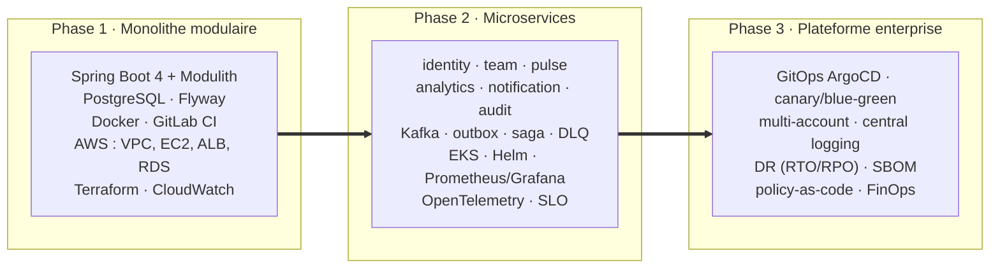

## L'architecture évolue avec les compétences

<v-clicks>

- Le découpage en **modules Modulith** (Phase 1) préfigure les **bounded contexts** des futurs services : la migration est un déplacement de frontières déjà tracées, pas une réécriture.
- Les événements Spring in-process deviennent des **événements Kafka** — même sémantique métier, transport différent.

</v-clicks>

---

## Stratégie d'environnements : payer juste ce qu'il faut

| Environnement                                                | Quand                   | Quoi                                                  |
| ------------------------------------------------------------ | ----------------------- | ----------------------------------------------------- |
| Local / Compose | Développement quotidien | PostgreSQL, Kafka local, tests, services simples      |
| LocalStack       | Intégration cloud-like  | S3, SQS/SNS, Lambda simple, secrets — sans facture    |
| AWS réel        | Semaines clés           | VPC, IAM, RDS, ALB, EKS, KMS, coûts NAT/endpoints, DR |

<v-click>

Principe : ne pas payer inutilement, mais ne pas tout simuler — certains comportements AWS (IAM réel, coûts, réseau) ne s'apprennent <strong>que sur AWS</strong>. Budgets et alertes de coût dès la première facture.

</v-click>

---

## Politique de versions

Règle : **la dernière génération stable et supportée** de chaque techno, mise à jour à chaque nouvelle semaine `Wxxx`.

| Techno                                                   | Cible actuelle                   | Modèle de support                                                   |
| -------------------------------------------------------- | -------------------------------- | ------------------------------------------------------------------- |
| Java                                                     | **25** (LTS)                     | LTS tous les 2 ans — 21 reste supporté                              |
| Spring Boot                                              | **4.1.x**                        | Pas de LTS : 12 mois d'OSS par mineure, une mineure tous les 6 mois |
| Spring Modulith                                          | **2.x** aligné sur le BOM Boot 4 | Suit le train Spring                                                |
| Angular (front à venir) | **22**                           | 6 mois actif + 12 mois LTS par majeure                              |
| PostgreSQL                                               | dernière majeure stable          | ~5 ans de support par majeure                                       |

<v-click>

Attention au vocabulaire : <strong>Spring Boot n'a pas de LTS</strong> — rester sur une mineure supportée impose une montée de version régulière (3.5 est EOL depuis juin 2026). C'est un choix assumé : le programme vit 28 mois, les montées de version font partie de l'apprentissage DevOps.

</v-click>

---

## Les artefacts d'architecte, chaque semaine

<v-clicks>

<h3>Décider</h3>

ADR · diagrammes C4 · diagrammes réseau · threat models

<h3>Exploiter</h3>

Runbooks · postmortems · SLO · checklists release & sécurité

<h3>Prouver</h3>

Architecture reviews · portfolio · ce deck, régénéré semaine après semaine

</v-clicks>

<v-click>

Rituel hebdomadaire : **1 commit** + **1 artefact** + **next steps** — le samedi matin est le cœur du progrès.

</v-click>
