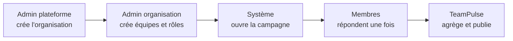
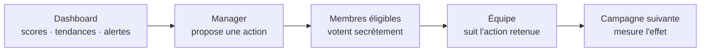
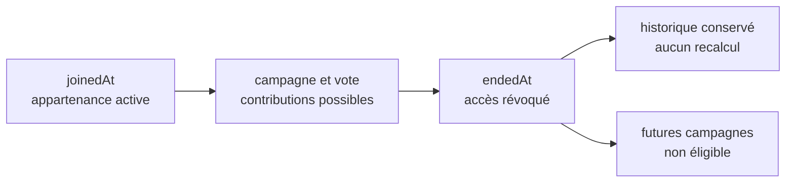

Le produit fil rouge

# TeamPulse, du signal à l'action collective

<PulseLine />

Chaque semaine, les membres partagent leur ressenti, leur charge et leurs blocages.

Le résultat ne finit pas dans un dashboard : le manager propose une action, l'équipe vote, puis la campagne suivante permet d'en mesurer l'effet.

Application témoin B2B
7 rôles contextualisés
1 boucle hebdomadaire

<!--
**Message à faire passer**

TeamPulse est une application témoin : son métier doit être cohérent et démontrable, mais il sert surtout à faire émerger de vrais problèmes d'architecture.

**Déroulé oral**

Présentez la boucle complète. Les membres donnent des signaux, TeamPulse protège et agrège les réponses, puis le manager transforme le résultat en proposition concrète. L'équipe vote, suit l'action retenue et observe son effet lors des campagnes suivantes. Cette continuité donne un sens aux choix techniques étudiés pendant le parcours.

**Insister sur**

La valeur ne vient ni du questionnaire ni du dashboard pris isolément. Elle vient de la capacité à décider collectivement et à apprendre dans le temps.

**Transition**

Commençons par le problème que les outils existants laissent entier.
-->

---

## Pourquoi l'entreprise adopte TeamPulse

<v-clicks>

<h3>Des signaux dispersés</h3>

Messagerie, réunions et outils de ticketing contiennent des indices, mais aucune vue régulière et comparable de la santé d'une équipe.

<h3>Une réaction trop tardive</h3>

Les enquêtes ponctuelles décrivent un état passé. Elles ne relient pas une alerte à une décision suivie dans le temps.

<h3>Peu de décision collective</h3>

Une action peut être annoncée en réunion sans proposition formelle, sans vote et sans règle d'éligibilité explicite.

<h3>Aucun apprentissage mesuré</h3>

L'entreprise ne sait pas si l'action a amélioré la tendance, ni pourquoi une décision avait été prise.

</v-clicks>

TeamPulse ferme la boucle : <strong>détecter → comprendre → proposer → voter → agir → mesurer</strong>, sans exposer les contributions individuelles.

<!--
**Message à faire passer**

TeamPulse répond à un manque de continuité entre le signal humain, la décision d'équipe et la mesure de son effet.

**Déroulé oral**

[click] Partez des outils déjà présents dans une entreprise : chat, réunions, tickets et enquêtes. Ils apportent des informations utiles, mais dispersées ou rétrospectives. Montrez ensuite les deux conséquences : une action arrive tard, puis disparaît sans vote formel ni suivi comparable. TeamPulse ne prétend pas remplacer ces outils ; il structure précisément la boucle qu'ils ne portent pas ensemble.

**Insister sur**

La confidentialité est une condition de confiance. TeamPulse publie des résultats exploitables, jamais un moyen de surveiller individuellement les salariés.

**Transition**

Pour exécuter cette boucle, il faut d'abord installer une organisation et ses équipes.
-->

---

## De la plateforme au résultat d'équipe

<h3>Frontière de tenant</h3>

Le compte plateforme ne fait partie d'aucune organisation et ne peut lire aucune donnée tenant.

<h3>Appartenance</h3>

Un utilisateur métier appartient à une seule organisation, mais peut participer à plusieurs équipes de celle-ci.

<v-click>

Une campagne publie scores, tendances, taux de participation, alertes et commentaires anonymisés uniquement si le seuil de confidentialité est atteint.

</v-click>

<!--
**Message à faire passer**

La collecte hebdomadaire repose sur une gouvernance et une frontière de données explicites avant même la première réponse.

**Déroulé oral**

Lisez le flux de gauche à droite. L'administrateur plateforme crée le tenant et désigne son premier administrateur sans entrer dans l'organisation. L'administrateur d'organisation structure ensuite les équipes et les rôles. Le système ouvre une campagne ; chaque membre éligible répond une fois pour son équipe. Enfin, TeamPulse agrège avant de publier.

[click] Faites apparaître le résultat visible et rappelez qu'un seuil insuffisant masque l'agrégat.

**Insister sur**

« Une organisation par utilisateur » n'interdit pas plusieurs équipes. Les rôles et les appartenances restent contextualisés à l'intérieur du même tenant.

**Transition**

Le résultat publié devient maintenant le point de départ d'une décision collective.
-->

---

## Du résultat à une action votée

<h3>Le manager comprend</h3>

Scores, évolution, participation, alertes, commentaires anonymisés et état des actions précédentes donnent du contexte.

<h3>L'équipe décide</h3>

La proposition est datée et reliée au résultat. Chaque membre éligible dispose d'un bulletin secret et unique.

Le manager peut proposer et piloter ; il ne peut ni modifier les réponses, ni voter à la place des membres, ni réécrire un résultat publié.

<!--
**Message à faire passer**

Le dashboard n'est utile que s'il mène à une action traçable, légitime et mesurable.

**Déroulé oral**

Commencez par ce que voit le manager : le score actuel, la tendance, la participation, les alertes, les commentaires anonymisés et l'effet des actions passées. Il formule ensuite une proposition reliée au résultat qui l'a motivée. Les membres éligibles votent une fois, sans révéler leur bulletin. Si l'action est acceptée, l'équipe suit son exécution et compare les campagnes suivantes.

**Insister sur**

Les pouvoirs restent séparés. Voir un résultat ne donne pas le droit de modifier une contribution ou de fabriquer l'adhésion de l'équipe.

**Transition**

Cette séparation dépend de rôles portés par un périmètre, pas d'une étiquette globale.
-->

---

## Les rôles portent un périmètre

| Périmètre | Rôles | Responsabilité principale |
| --------- | ----- | ------------------------- |
| Plateforme | Administrateur plateforme | Créer et superviser les organisations, sans accès tenant |
| Organisation | Administrateur · Manager · Auditeur | Administrer, suivre les tendances consolidées ou contrôler les traces |
| Équipe | Administrateur · Manager · Membre | Gérer l'appartenance, piloter les actions ou participer |

<h3>Les rôles se cumulent</h3>

Un admin d'organisation peut aussi manager une équipe ; un manager ou un admin reste membre des équipes auxquelles il appartient.

<h3>Les droits ne s'héritent pas</h3>

Être admin d'organisation n'accorde pas automatiquement l'accès aux résultats sensibles de toutes les équipes.

<!--
**Message à faire passer**

Un rôle TeamPulse décrit une capacité dans un périmètre précis ; il ne représente pas un rang global dans l'entreprise.

**Déroulé oral**

Lisez les trois niveaux. Le compte plateforme administre l'existence des organisations mais reste hors de leurs données. Dans une organisation, les responsabilités d'administration, de management et d'audit sont distinctes. Dans chaque équipe, un même utilisateur peut être membre, administrateur ou manager selon son affectation. Donnez l'exemple d'une personne admin d'une équipe et simple membre d'une autre.

**Insister sur**

Les rôles peuvent se cumuler, mais aucun rôle ne doit produire silencieusement tous les autres droits. Chaque autorisation combine l'organisation, l'équipe, l'appartenance active et l'action demandée.

**Transition**

Le périmètre doit aussi rester cohérent lorsqu'un membre quitte une équipe.
-->

---

## Retirer un membre sans réécrire l'histoire

<h3>Ce qui s'arrête</h3>

L'accès à l'équipe, aux campagnes ouvertes et aux nouveaux votes est révoqué immédiatement.

<h3>Ce qui reste</h3>

Réponses, bulletins déjà déposés, résultats publiés et traces d'audit restent immuables et comptabilisés.

Une réintégration crée une nouvelle période d'appartenance ; elle ne rend pas possible un second vote sur un ancien scrutin.

<!--
**Message à faire passer**

Retirer un membre est une fin d'appartenance, jamais une suppression rétroactive de son passage dans l'équipe.

**Déroulé oral**

Suivez la ligne du temps. À l'entrée, `joinedAt` ouvre une période et rend la personne éligible aux campagnes de l'équipe. Le retrait renseigne `endedAt` et coupe immédiatement les nouveaux accès. Les contributions déjà acceptées restent toutefois dans l'historique : supprimer un vote ou recalculer un résultat publié changerait le passé. Si la personne revient, TeamPulse crée une nouvelle période.

**Insister sur**

Le snapshot d'éligibilité d'un scrutin et l'appartenance temporelle répondent à deux questions différentes : qui pouvait voter à l'ouverture, puis quand l'accès courant doit être refusé.

**Transition**

Cette règle simple fait apparaître plusieurs problèmes d'architecture concrets.
-->

---

## Pourquoi TeamPulse oblige à penser architecture

<v-clicks>

<h3>Où vivent les responsabilités ?</h3>

Identité, organisation, équipe, campagne, résultat et action évoluent ensemble sans devoir devenir un seul bloc.

<h3>Qui peut faire quoi, maintenant ?</h3>

Tenant, rôle, équipe et période d'appartenance doivent produire une décision d'autorisation explicable.

<h3>Comment préserver l'histoire ?</h3>

Un retrait, une clôture ou une panne ne doit ni perdre un vote accepté ni exposer une contribution sensible.

<h3>Comment faire évoluer et exploiter ?</h3>

Base, API, événements, métriques et déploiements changent sans rompre la boucle métier.

</v-clicks>

Le cours introduit une décision technique seulement lorsqu'une étape observable du scénario la rend nécessaire.

<!--
**Message à faire passer**

L'architecture apparaît lorsque plusieurs invariants du scénario doivent rester vrais malgré le changement, la concurrence et les pannes.

**Déroulé oral**

[click] Parcourez les quatre questions sans donner immédiatement les solutions. La première concerne les frontières du code. La deuxième combine tenant, rôles et temps pour autoriser une action. La troisième protège l'historique et la confidentialité. La dernière porte sur l'évolution de la donnée et l'exploitation du système. Pour chaque carte, rattachez la question à une scène déjà racontée.

**Insister sur**

TeamPulse reste volontairement plus complet qu'un simple CRUD, car une architecture ne se démontre pas sur des classes isolées. Chaque technologie devra néanmoins répondre à un problème précis.

**Transition**

Avant W001, donnons une définition simple aux mots architecture, environnement et décision.
-->
