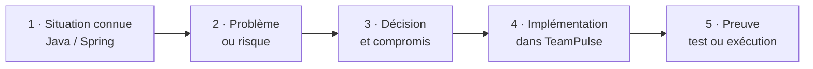

Point de départ · développeur Java / Spring / Angular

# Élargir son regard au-delà du code

<PulseLine />

Vous savez déjà construire un contrôleur, un service, un repository ou un composant Angular.

Le parcours apprend à décider **où placer ces éléments, qui peut dépendre de qui, comment les exécuter et comment prouver qu'ils forment un système cohérent**.

Acquis · développement applicatif
Objectif · raisonnement architectural

<!--
**Message à faire passer**

L'architecture prolonge les compétences de développement ; elle ne les remplace pas.

**Déroulé oral**

Rappelez des objets familiers : contrôleur, service, repository, composant Angular. Puis posez quatre questions : où les placer, qui peut les utiliser, de quoi ont-ils besoin pour s'exécuter et comment prouver qu'ils fonctionnent ensemble ? C'est le passage du code local au système cohérent.

**Insister sur**

Un bon développeur sait écrire un composant. Le raisonnement architectural consiste à maîtriser les relations entre les composants.

**Transition**

Voyons la méthode utilisée dans tout le cours pour apprendre ce raisonnement.
-->

---

## La méthode : problème → décision → preuve

Un concept architectural n'est jamais présenté seul. Il arrive lorsqu'une situation du produit le rend nécessaire.

<h3>ADR</h3>

<strong>Architecture Decision Record</strong> : une courte fiche qui conserve le problème, la décision, les alternatives et les conséquences.

<h3>Preuve exécutable</h3>

Un build, un test ou un démarrage réussi montre que la décision est réellement respectée par le code.

<!--
**Message à faire passer**

Une décision d'architecture doit toujours être reliée à un problème et à une preuve.

**Déroulé oral**

Lisez la chaîne de gauche à droite. La situation vient avant le vocabulaire technique. Le problème permet de comparer plusieurs options. La décision accepte un compromis, l'implémentation matérialise ce choix et la preuve vérifie qu'il est respecté.

**Insister sur**

Un ADR n'est pas une documentation générale : il conserve le contexte d'un choix, ses alternatives et ses conséquences. Une preuve exécutable évite qu'une décision reste une simple intention.

**Transition**

Cette méthode reste la même, mais les problèmes deviennent progressivement plus difficiles.
-->

---

## La difficulté augmente avec le produit

De <code>W01</code> à <code>W122</code>, chaque phase part d'un système maîtrisé avant d'ajouter une nouvelle difficulté.

<v-clicks>

Phase 1 · W01–W26
<h3>Une application structurée</h3>

Une seule application Spring Boot, découpée en modules clairs, testée et déployable.

Monolithe modulaire

Docker · CI · premières ressources AWS

Phase 2 · W27–W65
<h3>Des services autonomes</h3>

Certains modules deviennent des applications déployables indépendamment lorsque le besoin le justifie.

Microservices

Communication · Kubernetes · observabilité

Phase 3 · W66–W122
<h3>Une plateforme opérée</h3>

Les déploiements, la sécurité, la résilience et les coûts deviennent industrialisés.

Plateforme cloud

GitOps · reprise · gouvernance · FinOps

</v-clicks>

<v-click>

<strong>Principe pédagogique :</strong> on ne commence pas par les microservices. On apprend d'abord à créer des frontières propres dans une application simple à exécuter. Une spécialisation optionnelle suit après <code>W122</code>.

</v-click>

<!--
**Message à faire passer**

La complexité est introduite seulement lorsque le produit sait déjà absorber l'étape précédente.

**Déroulé oral**

Présentez les trois phases comme une montée en autonomie. La première apprend à structurer une application unique. La deuxième extrait certains services lorsque leur autonomie apporte une valeur réelle. La troisième industrialise l'exploitation d'une plateforme distribuée.

[click] Ne détaillez pas toutes les technologies affichées ; elles servent de repères temporels.

**Insister sur**

Les microservices ne sont ni un point de départ ni une récompense. Ils ajoutent un coût que l'équipe doit être capable de justifier et d'opérer.

**Transition**

Pour rendre cette progression concrète, découvrons maintenant le produit TeamPulse.
-->
