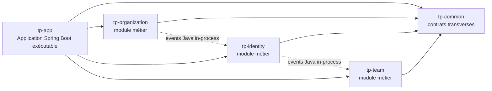

<!-- AUTO-GENERATED:W001:START -->

<span class="tp-kicker">Semaine 001 · Phase 1</span>

# Socle backend TeamPulse

<PulseLine />

Avant de mesurer le pouls d'une équipe, il faut un cœur qui batte : **le socle backend**.

<div class="mt-4">
<span class="tp-badge tp-badge--done">T01 livré</span>
<span class="tp-badge tp-badge--doc">T02 → T07 documentés</span>
</div>

---

## W001 · La problématique

<div class="tp-grid-2">

<div>

**Besoin fonctionnel**

<v-clicks>

- TeamPulse devra gérer des **organisations**, des **équipes** et des **utilisateurs**, puis collecter un **pulse hebdomadaire**
- Plusieurs organisations coexisteront à terme → penser **multi-tenant** dès la fondation
- Une **première API utilisateurs** doit exister pour prouver le bout-en-bout

</v-clicks>

</div>

<div>

**Besoin technique**

<v-clicks>

- Une organisation backend **claire, vérifiable et évolutive** — sans partir en microservices prématurés
- Une **base PostgreSQL locale** reproductible et un **schéma versionné** (Flyway)
- Un **packaging Docker** et des **profils d'environnement** pour préparer le cloud (Phase 1 → AWS)

</v-clicks>

</div>

</div>

<v-click>

<div class="tp-card tp-card--pulse mt-3">
En une phrase : poser un <strong>monolithe modulaire</strong> dont les frontières sont vérifiées par des tests — pour que l'évolution vers les microservices (Phase 2) soit un déplacement de frontières, pas une réécriture.
</div>

</v-click>

---

## W001 · Le découpage en tickets

| Ticket | Sujet                           | ADR                                           | État                                                  |
| ------ | ------------------------------- | --------------------------------------------- | ----------------------------------------------------- |
| `T01`  | Backend multi-module            | <span class="small muted">ADR-W001-T01</span> | <span class="tp-badge tp-badge--done">terminé</span>  |
| `T02`  | Docker Compose PostgreSQL local | <span class="small muted">ADR-W001-T02</span> | <span class="tp-badge tp-badge--doc">documenté</span> |
| `T03`  | Flyway schéma initial           | <span class="small muted">ADR-W001-T03</span> | <span class="tp-badge tp-badge--doc">documenté</span> |
| `T04`  | Multi-tenancy par `org_id`      | <span class="small muted">ADR-W001-T04</span> | <span class="tp-badge tp-badge--doc">documenté</span> |
| `T05`  | API utilisateurs minimale       | <span class="small muted">ADR-W001-T05</span> | <span class="tp-badge tp-badge--doc">documenté</span> |
| `T06`  | Dockerfile multi-stage          | <span class="small muted">ADR-W001-T06</span> | <span class="tp-badge tp-badge--doc">documenté</span> |
| `T07`  | Profils `local` et `localstack` | <span class="small muted">ADR-W001-T07</span> | <span class="tp-badge tp-badge--doc">documenté</span> |

<div class="tp-footref">
Références : docs/besoins/W001 · docs/adr/W001 — aucun ADR manquant constaté
</div>

---

## W001 · Pourquoi ce découpage ?

Chaque ticket isole **une décision d'architecture** (un ADR) et se livre indépendamment :

<v-clicks>

- `T01` — **le squelette d'abord** : sans frontières de modules vérifiées, tout le reste s'empile sur du sable
- `T02` → `T03` — **la donnée ensuite** : une base locale reproductible, puis un schéma versionné qui vivra jusqu'en production
- `T04` — **le transversal tôt** : le multi-tenancy par `org_id` traverse toutes les tables ; l'introduire après coup coûterait une migration massive
- `T05` — **la preuve bout-en-bout** : une API minimale qui traverse module → JPA → PostgreSQL valide toute la chaîne
- `T06` → `T07` — **le déploiement enfin** : packaging Docker et profils d'environnement, la passerelle vers la CI/CD et AWS des semaines suivantes

</v-clicks>

<v-click>

<div class="tp-card mt-3">
<strong>Convention du projet</strong> — la roadmap Excel décrit la <strong>fonctionnalité macro</strong> de la semaine ; le repo la découpe en <strong>tickets logiques</strong> <code>Txx</code>, chacun porté par un ADR.
</div>

</v-click>

---

## W001 · Architecture cible immédiate



<v-clicks>

- `tp-app` lance le serveur et **assemble** les modules — pas de HTTP interne entre modules
- Communications internes : **interfaces Java publiques** + **événements Spring**

</v-clicks>

<!-- AUTO-GENERATED:W001:END -->

---

layout: center
class: tp-section
transition: fade
routeAlias: w001-t01
---

<!-- AUTO-GENERATED:W001-T01:START -->

<span class="tp-kicker">W001 · Découpage 1/7</span>

# T01 — Backend multi-module

<PulseLine />

Poser une organisation backend **claire, vérifiable et évolutive** pour TeamPulse.

<div class="mt-4">
<span class="tp-badge tp-badge--done">commit 0d722a2</span>
<span class="tp-badge tp-badge--done">mvn clean verify ✓</span>
</div>

---

## T01 · Besoin & décision d'architecture

<div class="tp-grid-2">

<div>

**Livrables attendus**

<v-clicks>

- Parent Maven **multi-module**
- Module exécutable unique `tp-app`
- Bibliothèques `tp-common`, `tp-organization`, `tp-identity`, `tp-team`
- Frontières **Modulith** explicites
- Tests d'architecture via `mvn clean verify`

</v-clicks>

</div>

<div>

**Décisions retenues** <span class="small muted">(ADR-W001-T01)</span>

<v-clicks>

- Un **monolithe modulaire** Maven
- Spring Modulith en mode `explicitly-annotated`
- Surfaces publiques modulées : `api` et `events`
- OpenAPI réservé aux clients externes/front, **jamais** aux appels internes

</v-clicks>

</div>

</div>

---

## T01 · Séquence technique appliquée

<div class="tp-grid-2 mt-2">

<div>

<v-clicks>

1. Racine en parent Maven `packaging=pom`
2. Déclarer les 5 modules
3. Centraliser les versions : Java `21`, Spring Boot `4.0.6`, Modulith `2.0.6`, Lombok `1.18.46`
4. `spring-boot-maven-plugin` **uniquement** dans `tp-app`

</v-clicks>

</div>

<div>

<v-clicks>

5. `tp-app` = assembleur runtime des modules métier
6. `@ApplicationModule` sur chaque module
7. `@NamedInterface("api")` et `@NamedInterface("events")`
8. Tests Modulith + `mvn clean verify`

</v-clicks>

</div>

</div>

---

## T01 · Parent Maven & gestion des versions

<div class="tp-grid-2">

<div>

```xml
<packaging>pom</packaging>

<modules>
  <module>tp-organization</module>
  <module>tp-identity</module>
  <module>tp-team</module>
  <module>tp-app</module>
  <module>tp-common</module>
</modules>

<properties>
  <java.version>21</java.version>
  <spring-modulith.version>2.0.6</spring-modulith.version>
  <lombok.version>1.18.46</lombok.version>
</properties>
```

</div>

<div>

<v-clicks>

- Le parent importe le BOM `spring-modulith-bom` et déclare les **dépendances internes** (`tp-*`)
- Le parent **gère les versions** ; chaque module ne déclare que ce dont il a besoin
- Objectif : construire tous les modules ensemble, **zéro version divergente**

</v-clicks>

</div>

</div>

---

## T01 · Qui dépend de quoi, et pourquoi

| Module                                        | Dépendances clés                                                            | Rôle                                           |
| --------------------------------------------- | --------------------------------------------------------------------------- | ---------------------------------------------- |
| `tp-app`                                      | starter-web · modulith-core · les 4 modules `tp-*`                          | Seul exécutable — porte le plugin de repackage |
| `tp-organization` / `tp-identity` / `tp-team` | starter-web · modulith-api · modulith-events-api · validation · `tp-common` | Exposent controllers + API publique Java       |
| `tp-common`                                   | starter (sans web) · modulith-api                                           | Partage strict — **aucune** dépendance métier  |

<v-click>

<div class="tp-card tp-card--pulse mt-4">
Règle stricte : <code>tp-common</code> ne dépend d'aucun module métier — cela évite que le partage devienne un <strong>point de couplage caché</strong>. Lombok reste <code>optional</code> pour ne pas s'imposer aux consommateurs.
</div>

</v-click>

---

## T01 · Modulith : détection explicite & frontières

<div class="tp-grid-2">

<div>

```java
@SpringBootApplication
@Modulithic(
    systemName = "TeamPulse",
    sharedModules = "common"
)
public class TpAppApplication { /* ... */ }
```

```yaml
spring:
  application:
    name: tp-app
  modulith:
    detection-strategy: explicitly-annotated
```

</div>

<div>

```java
@ApplicationModule(
    displayName = "tp-organization",
    allowedDependencies = { "common" }
)
package io.teampulse.organization;
```

```java
@NamedInterface("api")
package io.teampulse.organization.api;
```

</div>

</div>

<v-click>

Seuls les packages annotés sont des modules : la structure est **volontaire, lisible et testable**. Un module métier peut dépendre de `common`, jamais des autres modules métier. Tout ce qui n'est pas `api` / `events` reste **interne par défaut**.

</v-click>

---

## T01 · Trois niveaux de tests

<div class="tp-grid-2 mt-2">

<v-clicks>

<div class="tp-card">
<h3>1 · Frontières</h3>

```java
ApplicationModules
  .of(TpAppApplication.class)
  .verify();
```

<p class="small muted">Échoue si un module dépend d'un module non autorisé ou consomme une interface interne.</p>
</div>

<div class="tp-card">
<h3>2 · Bootstrap par module</h3>

```java
@ApplicationModuleTest
public class OrganizationModuleTests {
  @Test void bootstrapsModule() {}
}
```

<p class="small muted">Démarre le module isolé — détecte vite un couplage accidentel. Idem pour <code>identity</code> et <code>team</code>.</p>
</div>

</v-clicks>

</div>

<v-click>

<div class="tp-card tp-card--pulse mt-3">
<h3>3 · Contexte global</h3>
<p class="small muted"><code>@SpringBootTest</code> dans <code>tp-app</code> : l'application <strong>assemblée</strong> démarre. La combinaison des trois garantit runtime chargé + frontières propres + modules bootstrappables seuls.</p>
</div>

</v-click>

---

## T01 · Validation & bilan

<div class="tp-grid-2">

<div>

```bash
mvn clean verify
```

<v-clicks>

- Build Maven en **succès**
- **6 tests** exécutés — 0 failure, 0 error, 0 skipped
- `ApplicationModules.verify()` valide les frontières
- Modules `organization`, `identity`, `team` bootstrappés isolément

</v-clicks>

</div>

<div v-click>

**Ce qui est vraiment acquis**

- Socle Maven multi-module
- Exécutable centralisé dans `tp-app`
- Modules détectables par Spring Modulith
- Règles de dépendances **vérifiées par test**
- Base saine pour `T02` → `T07` : PostgreSQL, Flyway, multi-tenancy, API et Docker

</div>

</div>

<div class="tp-footref">
W001-T01 : cohérent entre besoin, ADR et code commité
</div>

---

layout: default
---

## Annexe · Checklist de reproduction T01

<div class="tp-grid-2 small">

<div>

- Créer le parent Maven et les **5 modules**
- Point d'entrée uniquement dans `tp-app`
- Dépendances runtime dans `tp-app`
- Modulith API/events dans les modules métier
- `@ApplicationModule` dans chaque package racine

</div>

<div>

- `@NamedInterface` pour `api` et `events`
- `spring.modulith.detection-strategy: explicitly-annotated`
- `ApplicationModules.verify()` + tests `@ApplicationModuleTest`
- Exécuter `mvn clean verify`

</div>

</div>

<!-- AUTO-GENERATED:W001-T01:END -->
