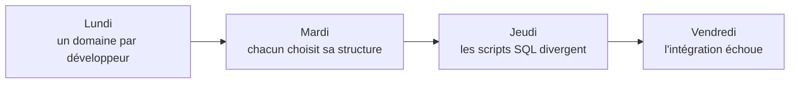
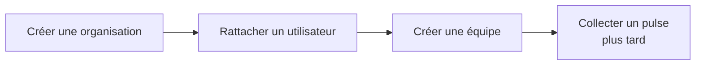
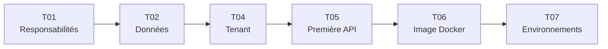
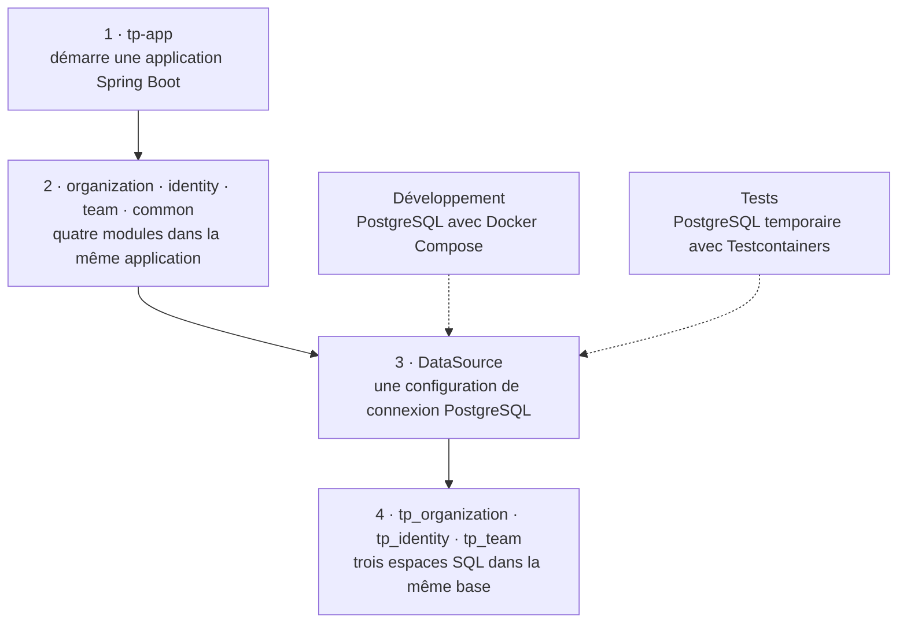
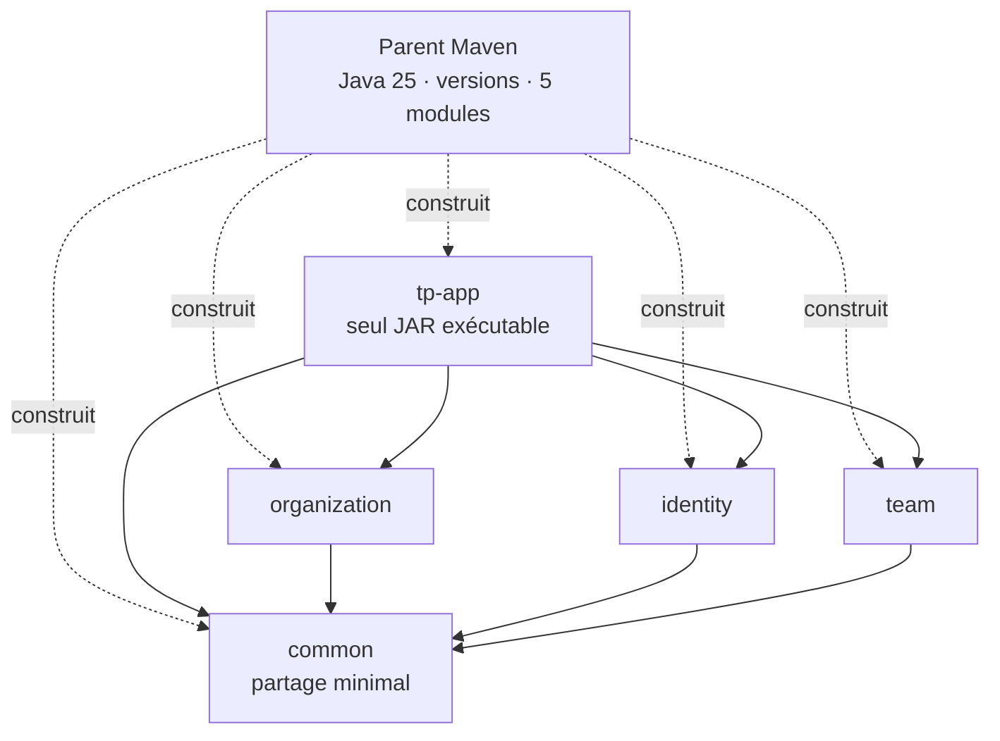
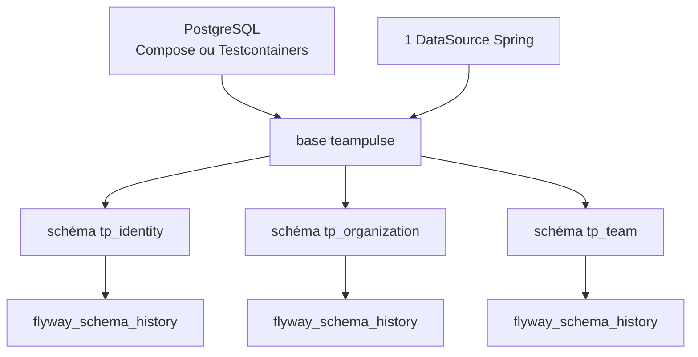
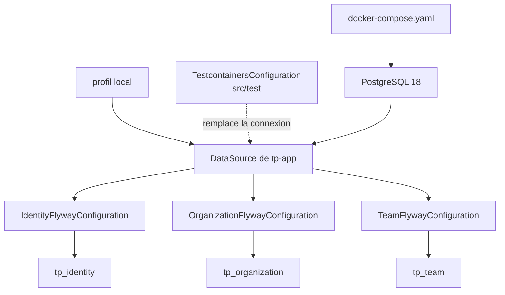

<!-- AUTO-GENERATED:W001:START -->

<span class="tp-kicker">W001 · Première mise en situation</span>

# Vendredi, tout doit fonctionner ensemble

<PulseLine />

TeamPulse doit bientôt permettre de créer une **organisation**, d'y rattacher des **utilisateurs** et de les regrouper en **équipes**.

Trois développeurs disposent d'une semaine pour préparer cette première verticale métier.

<v-click>

<div class="tp-card tp-card--pulse mt-4">
<strong>Mission :</strong> construire un socle Spring Boot commun que chacun peut comprendre, démarrer et tester, sans dépendre de la configuration personnelle d'un développeur.
</div>

</v-click>

<!--
**Message à faire passer**

W001 prépare une équipe à intégrer son travail dans un seul système ; elle ne cherche pas encore à livrer tout le métier TeamPulse.

**Déroulé oral**

Installez la scène : trois développeurs prennent en charge organisation, identité et équipe. Chacun peut réussir isolément, mais vendredi leurs contributions devront démarrer et être testées ensemble.

[click] Révélez la mission et reformulez-la avec trois exigences : une structure commune, un démarrage reproductible et une preuve indépendante du poste.

**Insister sur**

Le succès est collectif. « Cela fonctionne chez moi » ne prouve pas que le socle fonctionne pour l'équipe.

**Transition**

Voyons comment une semaine de décisions locales peut produire un échec d'intégration.
-->

---

## Du lundi au vendredi : où le risque apparaît



<div class="tp-grid-2 mt-2">

<div>

**Le code commence à se coupler**

<v-clicks>

- `identity` importe directement une classe interne de `organization`
- Du code métier est déplacé dans `common` pour aller plus vite

</v-clicks>

</div>

<div>

**Les postes ne racontent plus la même histoire**

<v-clicks>

- Chaque développeur utilise une installation PostgreSQL différente
- Les scripts SQL et les données sont appliqués manuellement

</v-clicks>

</div>

</div>

<v-click>

<div class="tp-card tp-card--warn mt-3">
Vendredi, chaque morceau fonctionne séparément, mais personne ne peut prouver que l'ensemble fonctionne. Il manque un contrat commun sur les <strong>responsabilités</strong>, la <strong>donnée</strong> et la <strong>validation</strong>.
</div>

</v-click>

<!--
**Message à faire passer**

Le risque vient de choix locaux raisonnables qui divergent en l'absence de contrat commun.

**Déroulé oral**

Parcourez la semaine de gauche à droite. Lundi, la répartition semble claire. Mardi, chacun structure selon ses habitudes. Jeudi, les scripts et les bases ne racontent plus la même histoire. Vendredi, l'intégration révèle les divergences trop tard.

[click] Distinguez les deux axes : couplage dans le code et différences d'exécution entre les postes.

[click] Concluez sur le triptyque responsabilités, donnée et validation.

**Insister sur**

Le problème n'est pas l'incompétence des développeurs, mais l'absence de décisions partagées et vérifiables.

**Transition**

Avant de choisir des outils, précisons ce que l'équipe et le produit doivent pouvoir faire.
-->

---

## Ce que W001 doit rendre possible



<div class="tp-grid-2 mt-3">

<div class="tp-card">

<h3>Pour l'équipe, dès maintenant</h3>

<v-clicks>

- Travailler en parallèle sur des domaines identifiés
- Démarrer la même application et la même base
- Versionner les changements de structure SQL

</v-clicks>

</div>

<div class="tp-card">

<h3>Pour le produit, ensuite</h3>

<v-clicks>

- Une organisation devient propriétaire de ses données : c'est le **tenant**
- Un utilisateur appartient à une organisation
- Une équipe regroupe les utilisateurs de cette organisation

</v-clicks>

</div>

</div>

<div class="tp-card tp-card--pulse mt-3 small">
W001 ne livre pas encore tout ce parcours métier. Il construit les frontières, la base et les tests qui permettront de livrer la première API sans repartir de zéro.
</div>

<!--
**Message à faire passer**

Le socle technique est justifié par un futur parcours métier précis, pas par une volonté abstraite de « faire de l'architecture ».

**Déroulé oral**

Commencez par le flux organisation, utilisateur, équipe, puis pulse. Séparez clairement les deux horizons : cette semaine, l'équipe doit travailler et démarrer de façon cohérente ; plus tard, le produit appliquera les règles de propriété et d'appartenance.

[click] Définissez le tenant simplement : l'organisation propriétaire d'un ensemble de données.

**Insister sur**

W001 prépare les conditions de livraison. Elle ne prétend pas livrer le parcours métier complet.

**Transition**

Transformons maintenant ce besoin en garanties que l'on pourra réellement vérifier.
-->

---

## Traduire le besoin en garanties vérifiables

<p class="small muted">Une garantie décrit un comportement observable. Elle permet ensuite de choisir un outil pour une raison précise.</p>

| Besoin concret | Garantie attendue |
| -------------- | ----------------- |
| Séparer les responsabilités | Un module ne peut pas accéder aux détails internes d'un autre |
| Partir du même état | Deux postes démarrent le même PostgreSQL avec une commande |
| Faire évoluer la donnée | Chaque changement SQL est versionné et rattaché à un module |
| Détecter tôt une erreur | Une dépendance interdite ou un SQL invalide fait échouer le test |
| Changer d'environnement | La configuration change sans modifier le code Java |

<v-click>

<div class="tp-card tp-card--pulse mt-3 small">
Les noms techniques viendront ensuite : Maven et Spring Modulith pour le code, Docker Compose pour PostgreSQL, Flyway pour le SQL et Testcontainers pour les tests.
</div>

</v-click>

<!--
**Message à faire passer**

Une garantie décrit d'abord un comportement observable ; l'outil n'est choisi qu'ensuite pour la faire respecter.

**Déroulé oral**

Lisez chaque ligne de gauche à droite. Par exemple, « partir du même état » devient « deux postes démarrent le même PostgreSQL avec une commande ». Cette formulation permet déjà d'imaginer une preuve sans connaître Docker Compose.

[click] Faites apparaître les noms techniques seulement après les garanties et reliez chacun à une ligne du tableau.

**Insister sur**

Si une technologie ne répond à aucune garantie, sa présence dans l'architecture doit être remise en question.

**Transition**

Ces garanties doivent maintenant respecter un périmètre et des contraintes explicites.
-->

---

## La règle du jeu de W001

<div class="tp-grid-2">

<div class="tp-card tp-card--pulse">
<h3>Ce que nous imposons</h3>

- Une seule unité déployable Spring Boot
- Une seule base PostgreSQL partagée par les modules
- Trois domaines métier et un module commun
- Une configuration locale activée explicitement
- Une base temporaire propre pour les tests

</div>

<div class="tp-card tp-card--warn">
<h3>Ce que nous reportons</h3>

- Découper TeamPulse en microservices
- Déployer sur un cloud réel
- Ajouter une authentification complète
- Faire communiquer les modules internes en HTTP
- Livrer déjà toutes les fonctionnalités métier

</div>

</div>

<div class="tp-card mt-3 small">
Cette contrainte est pédagogique : apprendre d'abord à créer des frontières dans une application simple, avant d'ajouter la complexité d'un système distribué.
</div>

<!--
**Message à faire passer**

Une architecture professionnelle dit autant ce qu'elle reporte que ce qu'elle construit maintenant.

**Déroulé oral**

Présentez d'abord les contraintes retenues : une unité déployable, une base, plusieurs domaines et des tests autonomes. Puis montrez ce qui est volontairement reporté. Le but est de résoudre le problème d'intégration sans introduire réseau, cloud ou authentification avant qu'ils soient nécessaires.

**Insister sur**

Reporter les microservices n'est pas les rejeter. C'est éviter de payer aujourd'hui un coût d'exploitation que le besoin actuel ne justifie pas.

**Transition**

Résumons la mission technique de la semaine en trois résultats concrets.
-->

---
layout: center
class: tp-section
transition: fade
---

<span class="tp-kicker">W001 · Mission technique</span>

# Organiser le code, la donnée et la preuve

<PulseLine />

Une seule application Spring Boot à déployer, mais des responsabilités séparées et vérifiées.

<div class="mt-4">
<span class="tp-badge tp-badge--done">Code · frontières explicites</span>
<span class="tp-badge tp-badge--doc">Donnée · démarrage reproductible</span>
<span class="tp-badge tp-badge--doc">Tests · indépendants du poste</span>
</div>

<!--
**Message à faire passer**

La mission W001 tient en trois résultats indissociables : organiser le code, rendre la donnée reproductible et produire une preuve fiable.

**Déroulé oral**

Présentez cette slide comme un point de contrôle avant le détail. Le code définit des frontières. La donnée démarre de la même façon pour tous. Les tests s'exécutent sans dépendre de la base personnelle d'un développeur.

**Insister sur**

Une seule application Spring Boot ne signifie pas un seul bloc sans structure. L'objectif est précisément d'obtenir des responsabilités séparées dans une unité simple à exécuter.

**Transition**

Traduisons cette mission technique en apprentissages concrets pour le participant.
-->

---

## À la fin de W001, vous saurez...

<div class="tp-grid-3 mt-3">

<v-clicks>

<div class="tp-card tp-card--pulse">
<h3>Comprendre</h3>
<p class="small muted">Distinguer un projet Maven multi-module, un monolithe modulaire et plusieurs microservices.</p>
<p class="small muted">Distinguer base, connexion, schéma et migration SQL.</p>
</div>

<div class="tp-card">
<h3>Construire</h3>
<p class="small muted">Assembler les domaines dans <code>tp-app</code> sans mélanger leurs responsabilités.</p>
<p class="small muted">Démarrer PostgreSQL localement et versionner le SQL de chaque module.</p>
</div>

<div class="tp-card">
<h3>Prouver</h3>
<p class="small muted">Faire vérifier les frontières par Spring Modulith.</p>
<p class="small muted">Lancer les tests sur un PostgreSQL temporaire créé par Testcontainers.</p>
</div>

</v-clicks>

</div>

<v-click>

<div class="tp-card tp-card--pulse mt-3 small">
Le résultat attendu n'est pas de recopier une configuration. Vous devrez relier chaque fichier à un problème, une décision et une preuve.
</div>

</v-click>

<!--
**Message à faire passer**

L'apprenant doit être capable d'expliquer, de construire et de prouver, pas seulement de reproduire des fichiers.

**Déroulé oral**

[click] Sur « Comprendre », vérifiez que les mots projet multi-module, monolithe modulaire, base, schéma et migration seront distingués.

[click] Sur « Construire », annoncez les manipulations concrètes dans TeamPulse.

[click] Sur « Prouver », expliquez que les frontières et la base temporaire seront vérifiées automatiquement.

**Insister sur**

À la fin, le participant doit pouvoir justifier le rôle de chaque configuration par un problème et une preuve.

**Transition**

Voici maintenant à quoi ressemble cette preuve dans la situation du vendredi soir.
-->

---

## Vendredi 17 h : le socle est accepté si...

<div class="tp-grid-2 mt-3">

<v-clicks>

<div class="tp-card tp-card--pulse">
<h3>Un nouveau développeur démarre PostgreSQL</h3>
<p class="small muted">Une commande Docker Compose suffit et le conteneur devient <code>healthy</code>.</p>
</div>

<div class="tp-card">
<h3>L'application part d'une base vide</h3>
<p class="small muted">Le profil <code>local</code> se connecte et Flyway prépare les espaces SQL des modules.</p>
</div>

<div class="tp-card">
<h3>Une mauvaise dépendance est refusée</h3>
<p class="small muted">Le test d'architecture échoue si un module accède à une partie interne d'un autre.</p>
</div>

<div class="tp-card">
<h3>Les tests n'utilisent pas la base locale</h3>
<p class="small muted">Testcontainers crée un PostgreSQL temporaire et propre pour la durée du test.</p>
</div>

</v-clicks>

</div>

<!--
**Message à faire passer**

La Definition of Done devient compréhensible lorsqu'elle décrit ce que des personnes peuvent observer vendredi à 17 h.

**Déroulé oral**

[click] Un nouveau développeur démarre la base sans procédure personnelle.

[click] L'application sait reconstruire sa structure depuis une base vide.

[click] Une dépendance interdite est refusée avant la revue ou la production.

[click] Les tests créent leur propre PostgreSQL et ne polluent pas le poste.

**Insister sur**

Chaque carte décrit un comportement attendu. Les commandes et frameworks sont seulement les mécanismes qui apportent la preuve. N'ajoutez pas de tests redondants si le démarrage du contexte prouve déjà suffisamment la garantie.

**Transition**

Découpons ces garanties en questions assez petites pour être traitées ticket par ticket.
-->

---

## Découper la semaine en questions simples

| Ticket | Question à résoudre | État |
| ------ | ------------------- | ---- |
| `T01` | Où placer le code et comment vérifier les frontières ? | <span class="tp-badge tp-badge--done">terminé</span> |
| `T02` | Comment partager PostgreSQL tout en laissant chaque module faire évoluer son SQL ? | <span class="tp-badge tp-badge--done">terminé</span> |
| `T04` | Comment garantir qu'une organisation ne voit que ses données ? | <span class="tp-badge tp-badge--doc">planifié</span> |
| `T05` | Comment prouver le premier parcours métier par une API ? | <span class="tp-badge tp-badge--doc">planifié</span> |
| `T06` | Comment produire une image exécutable de l'application ? | <span class="tp-badge tp-badge--doc">planifié</span> |
| `T07` | Comment changer d'environnement sans changer le code ? | <span class="tp-badge tp-badge--doc">planifié</span> |

<div class="tp-card tp-card--pulse mt-2 small">
<code>T03</code> n'est pas oublié : la création des schémas Flyway a été fusionnée dans <code>T02</code>, car démarrer la base et définir sa stratégie de migration forment une seule décision cohérente.
</div>

<!--
**Message à faire passer**

Les tickets sont des questions de conception successives, pas une simple liste de fichiers à produire.

**Déroulé oral**

Présentez T01 et T02 comme les deux fondations déjà livrées. T04 à T07 prolongeront le parcours vers l'isolation métier, l'API, l'image exécutable et les environnements.

**Insister sur**

T03 a été fusionné dans T02 parce que le démarrage de PostgreSQL et la stratégie Flyway forment une seule décision cohérente. Le numéro n'est pas réutilisé afin de conserver la traçabilité de la roadmap, des commits et de la documentation.

**Transition**

Cette liste devient réellement pédagogique lorsqu'on comprend pourquoi les questions sont traitées dans cet ordre.
-->

---

## Pourquoi cet ordre ?



<v-clicks>

- On identifie les responsabilités avant d'attribuer les tables
- On pose le tenant, c'est-à-dire l'organisation propriétaire des données, avant la première API
- On crée l'image Docker après avoir validé le comportement de l'application

</v-clicks>

<v-click>

<div class="tp-card tp-card--pulse mt-3 small">
Chaque ticket répond à une question nécessaire pour le suivant. L'ordre évite de construire une fonctionnalité sur une fondation encore ambiguë.
</div>

</v-click>

<!--
**Message à faire passer**

L'ordre des tickets réduit l'incertitude : chaque décision fournit une condition nécessaire à la suivante.

**Déroulé oral**

Lisez la chaîne de gauche à droite. On définit d'abord les responsabilités, puis l'espace de données de chaque responsabilité. On établit ensuite l'organisation propriétaire des données avant d'exposer une API. L'image Docker vient après la validation du comportement, puis les environnements s'appuient sur cette image.

[click] Reliez chaque flèche à une dépendance logique, pas seulement à une date de planning.

**Insister sur**

Changer cet ordre est possible, mais il faut alors accepter et expliquer le risque supplémentaire introduit.

**Transition**

Nous pouvons maintenant lire l'architecture cible, car le besoin et l'ordre des décisions sont compris.
-->

---

## Lire l'architecture cible, couche par couche



<div class="tp-card tp-card--pulse mt-2 small">
<strong>Module</strong> : frontière dans le code · <strong>DataSource</strong> : paramètres de connexion · <strong>schéma</strong> : espace nommé qui organise les tables dans une base.<br/>
<span class="muted">La lecture commence en haut : T01 construit l'application et ses modules ; T02 ajoute la connexion et les schémas SQL.</span>
</div>

<!-- AUTO-GENERATED:W001:END -->

<!--
**Message à faire passer**

W001 reste une seule application et une seule base, avec des frontières logiques explicites dans le code et dans les données.

**Déroulé oral**

Lisez strictement de haut en bas. `tp-app` démarre le runtime. Les quatre modules organisent les responsabilités. Le `DataSource` contient les paramètres d'une connexion PostgreSQL. Les schémas sont des espaces nommés qui organisent les tables dans cette même base.

Expliquez ensuite les deux pointillés : Docker Compose fournit PostgreSQL en développement ; Testcontainers fournit un PostgreSQL temporaire pendant les tests. Le contrat de connexion reste le même, l'instance change.

**Insister sur**

Un module n'est pas encore un microservice et un schéma n'est pas une base séparée.

**Transition**

Entrons dans T01 pour voir comment les frontières du code ont été construites et vérifiées.
-->

---
layout: center
class: tp-section
transition: fade
routeAlias: w001-t01
---

<!-- AUTO-GENERATED:W001-T01:START -->

<span class="tp-kicker">T01 · Reconnecter au problème de W001</span>

# Comment éviter trois backends incompatibles ?

<PulseLine />

Organisation, identité et équipe sont développées en parallèle par trois personnes, mais devront fonctionner vendredi dans **une seule application Spring Boot**.

T01 doit empêcher qu'un domaine dépende des détails internes d'un autre ou impose sa propre façon de construire l'application.

<div class="mt-4">
<span class="tp-badge tp-badge--doc">Question · où placer le code ?</span>
<span class="tp-badge tp-badge--done">Contrainte · un seul exécutable</span>
<span class="tp-badge tp-badge--done">Preuve · frontières testées</span>
</div>

<!--
**Message à faire passer**

T01 résout d'abord un problème d'équipe : permettre à trois développeurs de travailler séparément sans fabriquer trois applications incompatibles.

**Déroulé oral**

Revenez au scénario de W001. Chacun peut écrire un contrôleur ou un service Spring, mais le danger apparaît lorsque les responsabilités, les dépendances et le démarrage ne sont pas partagés. T01 organise le code ; T02 organisera ensuite la donnée. La contrainte reste une seule application à exécuter, car le besoin actuel ne justifie pas encore un système distribué.

**Insister sur**

Nous ne choisissons pas encore Maven multi-module ou Spring Modulith. Nous clarifions d'abord le problème qu'ils devront résoudre.

**Transition**

Avant de comparer les solutions, distinguons trois notions souvent confondues.
-->

---

## Avant de choisir : trois niveaux à ne pas confondre

<p class="small muted">Dans un projet Spring classique, packages, JAR et applications peuvent sembler désigner la même chose. Ils répondent pourtant à des questions différentes.</p>

<div class="tp-grid-3 mt-3">

<v-clicks>

<div class="tp-card">
<h3>Module Maven</h3>
<p class="small muted">Un sous-projet avec son propre <code>pom.xml</code>, ses dépendances et son JAR. Maven décide comment le construire.</p>
</div>

<div class="tp-card">
<h3>Module métier</h3>
<p class="small muted">Le code d'une responsabilité, par exemple <code>organization</code>. Spring Modulith vérifie qui peut utiliser quoi.</p>
</div>

<div class="tp-card">
<h3>Microservice</h3>
<p class="small muted">Une application autonome avec son processus, son déploiement et généralement des appels réseau.</p>
</div>

</v-clicks>

</div>

<v-click>

<div class="tp-card tp-card--pulse mt-3 small">
Un <strong>monolithe modulaire</strong> combine une seule application à déployer avec plusieurs modules métier dont les frontières restent explicites.
</div>

</v-click>

<!--
**Message à faire passer**

Un module Maven, un module métier et un microservice ne représentent pas le même niveau d'autonomie.

**Déroulé oral**

Partez d'un projet Spring connu : Maven construit des fichiers, mais il ne comprend pas les responsabilités métier.

[click] Un module Maven produit un artefact et possède ses dépendances.

[click] Un module métier protège une responsabilité à l'intérieur du système.

[click] Un microservice ajoute une application, un processus et des contraintes réseau indépendants.

[click] Définissez enfin le monolithe modulaire : un seul déploiement, mais des frontières internes explicites et vérifiables.

**Insister sur**

Créer plusieurs JAR ne crée pas automatiquement plusieurs microservices, ni même de bonnes frontières métier.

**Transition**

Nous pouvons maintenant comparer les options avec le besoin réel de W001.
-->

---

## Quel découpage convient à W001 ?

<div class="tp-grid-2 mt-2">

<div class="small">

| Option | Ce qu'elle apporte | Coût dans W001 |
| ------ | ------------------- | -------------- |
| Un seul module, règles par convention | Démarrage très rapide | Les frontières dépendent de la discipline humaine |
| **Monolithe modulaire** | Un déploiement et des frontières testables | Plus de configuration Maven et Modulith |
| Microservices par domaine | Déploiements indépendants | Réseau, sécurité, données et exploitation distribués |

</div>

<div>

<v-click>

<div class="tp-card tp-card--pulse">
<h3>Décision</h3>
<p class="small muted">Choisir le monolithe modulaire : une application simple à exécuter, mais des responsabilités séparées et vérifiées.</p>
</div>

<div class="tp-card tp-card--warn mt-3">
<h3>Compromis acceptés</h3>
<p class="small muted">Maintenir les dépendances à deux niveaux : Maven pour les JAR, Spring Modulith pour les frontières métier.</p>
<p class="small muted">Réévaluer si un domaine doit un jour être déployé, dimensionné ou possédé indépendamment.</p>
</div>

</v-click>

</div>

</div>

<div class="tp-footref">
Décision complète : docs/adr/W001/ADR-W001-T01-backend-multi-module.md
</div>

<!--
**Message à faire passer**

Le monolithe modulaire est choisi parce qu'il résout le problème actuel avec moins de complexité qu'un système distribué.

**Déroulé oral**

Comparez les options sur le même besoin. Un module unique est simple, mais ses frontières reposent sur les conventions. Les microservices rendent les domaines très autonomes, mais imposent immédiatement réseau, déploiements et données distribuées. W001 a besoin de travailler en parallèle et de vérifier les dépendances, pas encore de déployer chaque domaine séparément.

[click] Présentez la décision, puis le coût accepté : davantage de configuration et deux niveaux de dépendances à maintenir.

**Insister sur**

Une décision d'architecture n'est pas définitive. Elle doit indiquer le signal qui justifierait de la revoir.

**Transition**

Voyons comment cette décision devient une structure concrète dans TeamPulse.
-->

---

## Comment la décision devient-elle du code ?

<div class="tp-grid-2 mt-2">

<div>



<p class="small muted">Pointillés : construction Maven · Flèches pleines : dépendances Java</p>

</div>

<div>

<v-clicks>

1. Le parent construit les cinq sous-projets avec les mêmes versions.
2. `tp-app` assemble les modules et démarre l'unique application Spring Boot.
3. Chaque domaine produit un JAR bibliothèque et déclare sa racine avec `@ApplicationModule`.
4. Les packages `api` et `events` sont les portes publiques ; le reste demeure interne.

</v-clicks>

</div>

</div>

<v-click>

<div class="tp-card tp-card--pulse mt-2 small">
Une dépendance entre domaines doit être autorisée dans le <code>pom.xml</code> et par Spring Modulith. Les appels internes restent des appels Java, pas des appels HTTP.
</div>

</v-click>

<!--
**Message à faire passer**

La structure du dépôt matérialise deux idées : Maven construit les morceaux et Spring Modulith contrôle leurs relations métier.

**Déroulé oral**

Lisez d'abord le diagramme avec sa légende. Les pointillés partent du parent, qui construit tout avec Java 25. Les flèches pleines indiquent qui utilise qui.

[click] Le parent garantit un build cohérent.

[click] `tp-app` est l'assembleur et le seul exécutable.

[click] Chaque domaine reste une bibliothèque dans le même processus.

[click] `api` et `events` représentent les seules portes publiques d'un domaine.

[click] Une relation doit respecter Maven et Modulith ; aucun réseau interne n'est nécessaire.

**Insister sur**

Le module `common` reste minimal et ne dépend d'aucun domaine métier.

**Transition**

La structure est lisible ; il reste à prouver que le code la respecte réellement.
-->

---

## Vendredi 17 h : comment prouver que les frontières tiennent ?

<p class="small muted">Une règle d'architecture devient utile lorsqu'une violation fait échouer automatiquement le build.</p>

<div class="tp-grid-3 mt-3">

<v-clicks>

<div class="tp-card">
<h3>1 · Frontières</h3>
<p class="small muted"><code>ApplicationModules.verify()</code> refuse une dépendance interdite ou l'accès à une classe interne.</p>
</div>

<div class="tp-card">
<h3>2 · Module seul</h3>
<p class="small muted"><code>@ApplicationModuleTest</code> démarre un domaine avec un périmètre réduit et révèle un couplage caché.</p>
</div>

<div class="tp-card">
<h3>3 · Application complète</h3>
<p class="small muted"><code>@SpringBootTest</code> vérifie que <code>tp-app</code> assemble et démarre tous les modules.</p>
</div>

</v-clicks>

</div>

<v-click>

<div class="tp-card tp-card--pulse mt-3 small">
<code>mvn clean verify</code> → 6 tests réussis, frontières validées et un seul JAR Spring Boot exécutable produit par <code>tp-app</code>.
</div>

</v-click>

<div class="tp-footref">
Décision initiale : tag W001-T01-backend-multi-module · Stack actuelle : Java 25
</div>

<!--
**Message à faire passer**

T01 est terminé lorsque l'équipe peut observer que les frontières déclarées sont réellement imposées par le build.

**Déroulé oral**

Revenez à vendredi 17 h et associez chaque test à un risque précis.

[click] La vérification d'architecture refuse les dépendances interdites.

[click] Le test de module détecte qu'un domaine ne sait pas démarrer sans un autre domaine caché.

[click] Le test global confirme que l'application assemblée démarre.

[click] La commande unique produit la preuve complète : six tests réussis et un seul exécutable.

**Insister sur**

Les trois tests ne sont pas des doublons ; ils réduisent progressivement le périmètre du diagnostic.

**Transition**

Le parcours principal T01 s'arrête ici. Les slides suivantes sont des annexes à utiliser pendant le TP ou la correction.
-->

---

## Annexe T01 · Matérialiser les frontières avec Modulith

<p class="small muted">Support de TP : ces annotations traduisent dans le code les frontières expliquées dans le parcours principal.</p>

<div class="tp-grid-2">

<div>

```java
@SpringBootApplication
@Modulithic(
    systemName = "TeamPulse",
    sharedModules = "common"
)
public class TpAppApplication { /* ... */ }
```

```yaml
spring:
  application:
    name: tp-app
  modulith:
    detection-strategy: explicitly-annotated
```

</div>

<div>

```java
@ApplicationModule(
    displayName = "tp-organization",
    allowedDependencies = { "common" }
)
package io.teampulse.organization;
```

```java
@NamedInterface("api")
package io.teampulse.organization.api;
```

</div>

</div>

<v-click>

<div class="tp-card tp-card--pulse mt-2 small">
<code>@Modulithic</code> active le modèle · <code>@ApplicationModule</code> déclare une frontière et ses dépendances autorisées · <code>@NamedInterface</code> désigne une porte publique. Tout le reste demeure interne par défaut.
</div>

</v-click>

<!--
**Message à faire passer**

Cette annexe montre où retrouver dans le code les règles déjà comprises, sans introduire une nouvelle décision.

**Déroulé oral**

Utilisez cette slide pendant le TP. À gauche, `@Modulithic` active le modèle TeamPulse et la stratégie explicite exige qu'un module soit volontairement déclaré. À droite, `@ApplicationModule` définit la frontière `organization` et autorise seulement `common`. `@NamedInterface("api")` indique une entrée publique que les autres modules peuvent utiliser.

[click] Reformulez les trois annotations en langage simple avant de demander aux participants de les écrire.

**Insister sur**

Une classe Java peut être techniquement visible sans faire partie de l'API architecturale autorisée.

**Transition**

L'annexe suivante montre le code des tests qui contrôlent ces déclarations.
-->

---

## Annexe T01 · Les trois preuves dans le code

<p class="small muted">Support de correction : chaque test doit échouer pour une raison différente et fournir un diagnostic utile.</p>

<div class="tp-grid-2 mt-2">

<v-clicks>

<div class="tp-card">
<h3>1 · Frontières</h3>

```java
ApplicationModules
  .of(TpAppApplication.class)
  .verify();
```

<p class="small muted">Échoue si un module dépend d'un module non autorisé ou consomme une interface interne.</p>
</div>

<div class="tp-card">
<h3>2 · Bootstrap par module</h3>

```java
@ApplicationModuleTest
public class OrganizationModuleTests {
  @Test void bootstrapsModule() {}
}
```

<p class="small muted">Démarre le module isolé — détecte vite un couplage accidentel. Idem pour <code>identity</code> et <code>team</code>.</p>
</div>

</v-clicks>

</div>

<v-click>

<div class="tp-card tp-card--pulse mt-3">
<h3>3 · Contexte global</h3>
<p class="small muted"><code>@SpringBootTest</code> dans <code>tp-app</code> : l'application <strong>assemblée</strong> démarre. La combinaison des trois garantit runtime chargé + frontières propres + modules bootstrappables seuls.</p>
</div>

</v-click>

<!--
**Message à faire passer**

Cette annexe relie les trois garanties du parcours principal à leurs annotations et appels Java concrets.

**Déroulé oral**

[click] `ApplicationModules.verify()` lit la structure et refuse les violations de frontières.

[click] `@ApplicationModuleTest` charge un domaine dans un contexte réduit ; le test vide suffit ici parce que le comportement attendu est le démarrage.

[click] `@SpringBootTest` charge l'assemblage complet depuis `tp-app`.

**Insister sur**

Un test vide n'est pas inutile lorsque le démarrage du contexte constitue précisément la preuve recherchée. N'ajoutez pas d'assertion artificielle seulement pour remplir le test.

**Transition**

L'annexe suivante distingue la livraison initiale de T01 et l'état actuel du dépôt.
-->

---

## Annexe T01 · Une décision évolue sans perdre sa trace

<p class="small muted">Le tag raconte la livraison initiale ; la branche courante raconte le système après ses montées de version.</p>

| Repère Git | Ce qu'il permet d'étudier | Stack observée dans le `pom.xml` |
| ---------- | -------------------------- | -------------------------------- |
| `W001-T01-backend-multi-module` · `22a78a0` | La création des cinq modules et des six tests T01 | Java 21 · Spring Boot 4.0.6 |
| Branche courante | La même décision après évolution du socle | **Java 25** · Spring Boot 4.1.0 |

<v-click>

<div class="tp-card tp-card--pulse mt-3 small">
Le cours utilise la stack actuelle. Le tag reste la référence historique pour comprendre la décision T01. Pour reproduire exactement un état, lire les manifests de ce repère Git plutôt qu'un numéro copié dans une slide.
</div>

</v-click>

<div class="tp-footref">
Tag stable : W001-T01-backend-multi-module · Merge : 22a78a0
</div>

<!--
**Message à faire passer**

Une décision d'architecture peut rester valide alors que les versions techniques évoluent ; Git permet de distinguer ces deux histoires.

**Déroulé oral**

Expliquez les deux lignes. Le tag stable permet d'étudier la livraison initiale de T01 : cinq modules et six tests, à l'époque sous Java 21 et Spring Boot 4.0.6. La branche actuelle conserve la même organisation, mais le socle est passé à Java 25 et Spring Boot 4.1.0.

[click] Précisez pourquoi les slides utilisent Java 25 : elles accompagnent le dépôt actuel. Pour une reproduction historique, les manifests du tag font foi.

**Insister sur**

Ne mélangez jamais une preuve historique, une documentation de décision et les versions courantes sans annoncer le repère utilisé.

**Transition**

La dernière annexe fournit la checklist pratique de reproduction sur le dépôt actuel.
-->

---
layout: default
---

## Annexe T01 · Checklist de reproduction sur le dépôt actuel

<p class="small muted">À utiliser pendant le TP avec Java 25. Chaque ligne doit pouvoir être reliée à un risque expliqué dans le parcours principal.</p>

<div class="tp-grid-2 small">

<div>

- Créer le parent Maven et les **5 modules**
- Point d'entrée uniquement dans `tp-app`
- Dépendances runtime dans `tp-app`
- Modulith API/events dans les modules métier
- `@ApplicationModule` dans chaque package racine

</div>

<div>

- `@NamedInterface` pour `api` et `events`
- `spring.modulith.detection-strategy: explicitly-annotated`
- `ApplicationModules.verify()` + tests `@ApplicationModuleTest`
- Exécuter `mvn clean verify`

</div>

</div>

<!-- AUTO-GENERATED:W001-T01:END -->

<!--
**Message à faire passer**

Cette annexe est un filet de sécurité pour reproduire T01 avec la stack actuelle, pas une nouvelle séquence de cours.

**Déroulé oral**

Ne lisez pas chaque ligne pendant la présentation principale. Utilisez la checklist pendant le TP, la correction ou un dépannage. Demandez au participant d'associer chaque élément à son rôle : le parent construit, `tp-app` exécute, les modules portent les responsabilités, les interfaces nommées exposent les portes publiques et les tests contrôlent les frontières.

**Insister sur**

La présence des fichiers ne suffit pas. Le participant doit expliquer quel risque chaque ligne réduit et vérifier le résultat avec `mvn clean verify` sous Java 25.

**Transition**

Les frontières du code sont maintenant reproductibles. T02 applique le même raisonnement aux données, à l'environnement local et aux tests d'intégration.
-->

---
layout: center
class: tp-section
transition: fade
routeAlias: w001-t02
---

<!-- AUTO-GENERATED:W001-T02:START -->

<span class="tp-kicker">T02 · Reconnecter au problème de W001</span>

# Comment partager PostgreSQL sans mélanger les données ?

<PulseLine />

Après T01, les trois domaines tiennent dans une seule application. Mais un nouveau développeur reçoit encore une base vide, une configuration locale à deviner et des tests qui ne doivent jamais dépendre de ses données personnelles.

T02 doit rendre la donnée **reproductible** sans transformer les modules en microservices.

<div class="mt-4">
<span class="tp-badge tp-badge--doc">Situation · une base vide</span>
<span class="tp-badge tp-badge--done">Contrainte · une seule application</span>
<span class="tp-badge tp-badge--done">Preuve · local et tests isolés</span>
</div>

<!--
**Message à faire passer**

T02 ne commence pas par Docker ou Flyway : il commence par le besoin de retrouver la même structure de données sur chaque poste et dans chaque test.

**Déroulé oral**

Reprenez le scénario de W001. Le code est désormais bien séparé, mais le démarrage reste fragile si chacun installe PostgreSQL différemment, conserve un état inconnu ou partage sa base locale avec les tests. Le développeur doit pouvoir obtenir une base connue, puis lancer l'application avec une configuration explicite. Un test doit, lui, partir d'une base temporaire et indépendante.

**Insister sur**

Nous conservons un monolithe modulaire : une application, une connexion principale et aucune communication réseau entre les modules.

**Transition**

Pour construire cette solution, séparons d'abord le rôle de Docker du rôle de Spring.
-->

---

## Docker et Spring ne répondent pas à la même question

<p class="small muted">Un environnement local reproductible possède deux responsabilités complémentaires : exécuter PostgreSQL et expliquer à l'application comment s'y connecter.</p>

<div class="tp-grid-2 mt-3">

<v-clicks>

<div class="tp-card">
<h3>Faire tourner PostgreSQL</h3>
<p class="small muted"><strong>Une image</strong> est le modèle versionné. <strong>Un conteneur</strong> est son processus en cours d'exécution. Docker Compose décrit l'image, le port, le volume et le contrôle de disponibilité.</p>
</div>

<div class="tp-card">
<h3>Connecter l'application</h3>
<p class="small muted"><strong>Un profil Spring</strong> sélectionne une configuration d'environnement. Le profil <code>local</code> fournit au <strong>DataSource</strong> l'URL, l'utilisateur et le mot de passe PostgreSQL.</p>
</div>

</v-clicks>

</div>

<v-click>

<div class="tp-card tp-card--pulse mt-3">
Dans le périmètre actuel, Compose démarre <strong>PostgreSQL seulement</strong>. L'application reste lancée depuis Maven ou l'IDE avec <code>SPRING_PROFILES_ACTIVE=local</code>.
</div>

</v-click>

<!--
**Message à faire passer**

Docker contrôle le processus PostgreSQL ; Spring contrôle la connexion de l'application. Mélanger ces responsabilités rend la configuration difficile à déplacer.

**Déroulé oral**

[click] Partez de Docker : l'image fixe la version PostgreSQL, le conteneur est l'instance qui tourne, le volume conserve les données et le healthcheck indique quand la base accepte réellement des connexions.

[click] Passez ensuite à Spring. Le profil `local` ne démarre aucune base ; il choisit seulement les valeurs qui alimentent le `DataSource`, c'est-à-dire l'objet de connexion utilisé par JPA et Flyway.

[click] Le Compose actuel ne construit pas encore l'API. C'est un choix de périmètre : le développeur garde une boucle Java rapide dans l'IDE, tandis que PostgreSQL reste reproductible.

**Insister sur**

Un conteneur démarré n'implique pas qu'il soit déjà prêt. C'est précisément le rôle du healthcheck.

**Transition**

La connexion est claire ; regardons maintenant ce qu'elle trouve à l'intérieur de PostgreSQL.
-->

---

## Une base, trois espaces de travail

<div class="tp-grid-2 mt-2">

<div>



<p class="small muted">Lecture de haut en bas : l'instance change entre local et test, mais la base et ses trois espaces logiques gardent le même contrat.</p>

</div>

<div class="tp-card small">

<v-clicks>

<p><strong>Base de données</strong><br/><span class="muted">La destination <code>teampulse</code> à laquelle le DataSource se connecte.</span></p>

<p><strong>Schéma PostgreSQL</strong><br/><span class="muted">Un espace nommé qui qualifie les tables, par exemple <code>tp_identity.users</code>.</span></p>

<p><strong>Migration et historique</strong><br/><span class="muted">Un changement SQL versionné et le journal des versions déjà appliquées.</span></p>

</v-clicks>

</div>

</div>

<v-click>

<div class="tp-card tp-card--pulse mt-2 small">
Chaque module peut commencer par sa propre <code>V1</code>. Aucune migration SQL vide n'est créée : <code>createSchemas(true)</code> prépare le schéma et l'historique, puis la première vraie migration introduira la première table métier.
</div>

</v-click>

<!--
**Message à faire passer**

Séparer les schémas ne crée pas trois bases ni trois connexions ; cela donne à chaque module un espace SQL et un historique de migrations indépendants.

**Déroulé oral**

Lisez le diagramme de haut en bas. PostgreSQL peut venir de Compose ou de Testcontainers. Le même `DataSource` se connecte à la base `teampulse`, puis trois configurations Flyway travaillent dans trois schémas.

[click] La base est la destination de la connexion.

[click] Le schéma est un namespace interne : il évite que toutes les tables se retrouvent sans propriétaire dans `public`.

[click] La table `flyway_schema_history` est le journal technique des migrations déjà appliquées.

[click] Chaque module possède donc sa propre suite de versions. Une migration vide n'ajouterait aucun contrat métier et serait seulement du bruit.

**Insister sur**

Une table d'historique Flyway par schéma est la condition qui permet à plusieurs modules d'avoir chacun une migration `V1`.

**Transition**

Nous pouvons maintenant comparer les niveaux d'isolation possibles et justifier celui de T02.
-->

---

## Quel niveau d'isolation convient à W001 ?

<div class="small">

| Option | Ce qu'elle simplifie | Coût ou risque dans W001 |
| --- | --- | --- |
| Un schéma et un historique globaux | Une seule configuration Flyway | Propriété des tables floue et versions coordonnées entre modules |
| Une base par module | Isolation technique forte | Connexions et exploitation trop lourdes pour une seule application |
| **Une base, trois schémas et trois historiques** | Frontières SQL alignées sur les modules | Trois configurations Flyway à maintenir |

</div>

<v-click>

<div class="tp-grid-2 mt-3">
<div class="tp-card tp-card--pulse">
<h3>Décision</h3>
<p class="small muted">Une seule base <code>teampulse</code> et un seul DataSource, avec un Flyway par module, réutilisable lors d'une future extraction.</p>
</div>
<div class="tp-card tp-card--warn">
<h3>Compromis acceptés</h3>
<p class="small muted">Docker devient un prérequis, les entités devront déclarer leur schéma et les requêtes SQL directes entre schémas devront rester exceptionnelles.</p>
</div>
</div>

</v-click>

<div class="tp-footref">
Décision : docs/adr/W001/ADR-W001-T02-docker-compose-local.md
</div>

<!--
**Message à faire passer**

Le choix de T02 maximise l'autonomie des modules sans payer dès maintenant le coût de plusieurs bases et de plusieurs applications.

**Déroulé oral**

Comparez les trois lignes à partir du besoin actuel. Le schéma global est facile au début, mais il oblige les modules à partager le même journal et à coordonner leurs numéros. Une base par module prépare une isolation physique, mais impose plusieurs connexions et davantage d'exploitation alors que TeamPulse reste un seul processus.

[click] La décision intermédiaire conserve une seule connexion tout en rendant la propriété SQL explicite. Elle facilite une extraction future, mais ne la rend pas automatique.

**Insister sur**

Le mot « isolé » signifie ici isolation logique. Une requête SQL pourrait techniquement traverser les schémas ; l'équipe doit donc conserver la discipline des frontières.

**Transition**

Voyons comment cette décision se répartit dans le dépôt sans créer une configuration globale cachée.
-->

---

## Comment la décision traverse-t-elle le dépôt ?

<div class="tp-grid-2 mt-2">

<div>



<p class="small muted">Traits pleins : exécution locale. Pointillés : remplacement de l'infrastructure pendant les tests.</p>

</div>

<div class="small">

<v-clicks>

<p><strong>1.</strong> <code>docker-compose.yaml</code> fixe image, volume, port et healthcheck.</p>
<p><strong>2.</strong> <code>application.yaml</code> désactive Flyway global et impose <code>validate</code>.</p>
<p><strong>3.</strong> <code>application-local.yaml</code> fournit le DataSource surchargeable.</p>
<p><strong>4.</strong> Chaque module possède schéma, historique et migrations.</p>
<p><strong>5.</strong> La configuration Testcontainers reste dans <code>tp-app/src/test</code>.</p>

</v-clicks>

</div>

</div>

<!--
**Message à faire passer**

La configuration suit les responsabilités : `tp-app` possède la connexion du runtime, chaque module possède l'évolution de son schéma et les tests possèdent leur infrastructure éphémère.

**Déroulé oral**

Lisez le diagramme de gauche à droite puis de haut en bas.

[click] Compose décrit uniquement PostgreSQL.

[click] La configuration commune empêche Flyway et Hibernate d'inventer une stratégie globale.

[click] Le profil local fournit les valeurs de connexion sans devenir le profil par défaut du projet.

[click] Chaque module construit sa propre instance Flyway à partir du même `DataSource`.

[click] La configuration Testcontainers reste dans les sources de test ; elle n'est ni chargée ni empaquetée en production.

**Insister sur**

Un `application.yaml` par module n'offre pas automatiquement une configuration indépendante dans une seule application. L'indépendance utile est portée ici par la configuration Flyway Java et par le runtime qui fournit le DataSource.

**Transition**

Cette répartition doit maintenant produire des preuves différentes en local, dans un test ciblé et dans la suite complète.
-->

---

## Vendredi 17 h : que doit observer le développeur ?

<div class="tp-grid-3 mt-3">

<v-clicks>

<div class="tp-card">
<h3>1 · En local</h3>
<p class="small muted">PostgreSQL devient <code>healthy</code>. Le profil <code>local</code> connecte l'application et les trois schémas sont initialisés.</p>
</div>

<div class="tp-card">
<h3>2 · Test ciblé</h3>
<p class="small muted">Un PostgreSQL temporaire démarre sur un port aléatoire. Le test de module charge seulement sa configuration Flyway.</p>
</div>

<div class="tp-card">
<h3>3 · Suite complète</h3>
<p class="small muted">Le contexte global charge les trois configurations. Le dépôt actuel termine avec <strong>6 tests, 0 échec</strong>.</p>
</div>

</v-clicks>

</div>

<v-click>

<div class="tp-card tp-card--pulse mt-3 small">
La preuve attendue est le <strong>démarrage réussi du contexte</strong>. Une connexion impossible, une migration invalide ou un modèle JPA incompatible fait déjà échouer le test ; aucune assertion SQL redondante n'est nécessaire tant qu'il n'existe pas de migration métier.
</div>

</v-click>

<div class="tp-footref">
Besoin : docs/besoins/W001/W001-T02-PostgreSQL-local-et-schemas-Flyway.md
</div>

<!--
**Message à faire passer**

T02 est terminé lorsque les trois modes d'exécution produisent une base prévisible et que les erreurs de connexion, de migration ou de mapping interrompent automatiquement le démarrage.

**Déroulé oral**

[click] En local, l'observation commence par le statut `healthy`, puis par le démarrage de l'application avec le profil explicite.

[click] Dans un test de module, Testcontainers remplace la connexion locale et le contexte Modulith réduit le périmètre au domaine ciblé.

[click] Dans le test global, les trois configurations Flyway sont présentes. La suite courante compte six tests réussis.

[click] Le contexte Spring est ici le contrat testé. Interroger ensuite les tables système de Flyway répéterait son propre travail sans ajouter de règle métier.

**Insister sur**

Testcontainers n'utilise pas le PostgreSQL de Compose. Docker doit être disponible, mais le port local `5432` et les données du développeur ne participent pas au test.

**Transition**

Le parcours principal est terminé. Les annexes suivantes servent au TP, à la correction et au diagnostic.
-->

---
layout: default
---

## Annexe T02 · Activer le profil local dans IntelliJ

<div class="tp-grid-2 mt-2">

<div class="small">

<div class="tp-card">
<h3>Configuration de lancement</h3>

1. Ouvrir <strong>Run / Debug Configurations</strong>.
2. Sélectionner <code>TpAppApplication</code>.
3. Dans <strong>Environment variables</strong>, ajouter :

```text
SPRING_PROFILES_ACTIVE=local
```

4. Démarrer l'application.
</div>

<div class="tp-card tp-card--warn mt-3">
Le profil <code>local</code> reste absent du POM et de <code>application.yaml</code> : l'environnement est choisi par le processus qui démarre l'application.
</div>

</div>

<div>
<div class="tp-screenshot-focus">

</div>
</div>

</div>

<!--
**Message à faire passer**

Le profil local appartient à la configuration d'exécution du développeur, pas au build Maven ni au comportement par défaut de l'application.

**Déroulé oral**

Utilisez cette annexe pendant le TP. Ouvrez la configuration Spring Boot `TpAppApplication`, puis repérez la zone agrandie à droite. La variable `SPRING_PROFILES_ACTIVE=local` est placée dans `Environment variables`, tandis que le champ « Active profiles » peut rester vide.

Expliquez qu'une variable d'environnement fonctionne aussi en terminal, en CI ou dans un conteneur. Le même artefact Java peut donc recevoir une configuration différente selon le processus qui le lance.

**Insister sur**

Activer `local` dans le POM couplerait la construction du logiciel à un environnement particulier et pourrait surprendre les tests ou un futur déploiement.

**Transition**

La capture montre où activer le profil ; l'annexe suivante relie ce choix aux commandes locales et aux valeurs qu'il sélectionne.
-->

---

## Annexe T02 · Lire la configuration locale

<p class="small muted">Compose décrit le service PostgreSQL. Spring décrit la connexion utilisée par l'application. Les deux fichiers partagent des valeurs compatibles, mais pas la même responsabilité.</p>

<div class="tp-grid-2 mt-2">

<div>

```yaml
# docker/docker-compose.yaml
postgres:
  image: postgres:18-bookworm
  environment:
    POSTGRES_DB: teampulse
    POSTGRES_USER: teampulse
    POSTGRES_PASSWORD: teampulse
  ports: ["5432:5432"]
  volumes:
    - teampulse-postgres-data:/var/lib/postgresql
  healthcheck:
    test: ["CMD-SHELL",
      "pg_isready -U teampulse -d teampulse"]
```

</div>

<div>

```yaml
# tp-app/application-local.yaml
spring:
  datasource:
    url: ${TEAM_PULSE_DB_URL:
      jdbc:postgresql://localhost:5432/teampulse}
    username: ${TEAM_PULSE_DB_USERNAME:teampulse}
    password: ${TEAM_PULSE_DB_PASSWORD:teampulse}
```

</div>

</div>

<div class="tp-card tp-card--pulse mt-2 small">
<code>down</code> arrête les conteneurs et conserve le volume. <code>down -v</code> supprime aussi les données : c'est la commande volontaire pour repartir d'une base vide.
</div>

<!--
**Message à faire passer**

Les valeurs par défaut accélèrent le développement local, tandis que les variables d'environnement permettent de changer la connexion sans modifier le dépôt.

**Déroulé oral**

Lisez d'abord la colonne Compose. Le tag explicite rend la version reproductible. Le port publie PostgreSQL sur la machine, le volume nommé conserve les données et `pg_isready` fournit un signal de disponibilité.

Passez ensuite à Spring. La syntaxe `${VARIABLE:valeur}` signifie « utiliser la variable si elle existe, sinon la valeur locale ». Ce fichier ne contient pas la stratégie Flyway des modules ; il configure uniquement le `DataSource` du runtime.

Terminez par le cycle du volume : `down` arrête, `down -v` réinitialise.

**Insister sur**

Les identifiants affichés sont des valeurs de développement local. Une valeur de production ne doit jamais être commise dans ce fichier.

**Transition**

La connexion est prête ; regardons comment un module prend en charge son propre schéma.
-->

---

## Annexe T02 · Une configuration Flyway par module

<div class="tp-grid-2 mt-2">

<div>

```java
@Configuration
public class IdentityFlywayConfiguration {

  @Bean
  FlywayMigrationInitializer initializer(
      DataSource dataSource) {
    Flyway flyway = Flyway.configure()
      .dataSource(dataSource)
      .createSchemas(true)
      .schemas("tp_identity")
      .defaultSchema("tp_identity")
      .table("flyway_schema_history")
      .locations("classpath:db/migration/identity")
      .load();

    return new FlywayMigrationInitializer(flyway);
  }
}
```

</div>

<div class="small">

<v-clicks>

1. Le `DataSource` vient de `tp-app` ou de Testcontainers.
2. `createSchemas(true)` crée l'espace avant l'historique.
3. `defaultSchema` place l'historique et les migrations au bon endroit.
4. `locations` appartient au module et contient ses futurs fichiers SQL.
5. L'initialiseur exécute Flyway pendant le démarrage Spring.

</v-clicks>

<div class="tp-card tp-card--warn mt-3">
La première migration SQL sera ajoutée avec le premier changement métier. Créer un fichier vide uniquement pour le schéma dupliquerait le rôle de cette configuration.
</div>

</div>

</div>

<!--
**Message à faire passer**

Chaque configuration Flyway relie une connexion fournie par le runtime à un schéma, un historique et un répertoire de migrations possédés par le module.

**Déroulé oral**

[click] Le module ne construit pas sa propre connexion : il reçoit le `DataSource` Spring.

[click] `createSchemas(true)` garantit que le namespace existe avant la création de l'historique.

[click] `defaultSchema` évite que la table Flyway se retrouve dans `public`.

[click] `locations` donne au module la propriété de ses fichiers SQL et de leur numérotation.

[click] `FlywayMigrationInitializer` déclenche cette instance pendant l'initialisation du contexte.

**Insister sur**

Les trois classes sont volontairement similaires mais restent dans leurs modules. Une abstraction commune ne sera utile que si elle réduit réellement une divergence observée sans masquer les paramètres importants.

**Transition**

Le même code Flyway doit fonctionner avec une base locale ou temporaire ; Testcontainers fournit cette seconde infrastructure.
-->

---

## Annexe T02 · Testcontainers reste dans `tp-app`

<div class="tp-grid-2 mt-2">

<div>

```java
@TestConfiguration(proxyBeanMethods = false)
class TestcontainersConfiguration {

  @Bean
  @ServiceConnection
  PostgreSQLContainer postgresContainer() {
    return new PostgreSQLContainer(
      "postgres:18-bookworm");
  }
}
```

<p class="small muted"><code>@ServiceConnection</code> transmet automatiquement l'URL, l'utilisateur et le mot de passe du conteneur au DataSource de test.</p>

</div>

<div>

```java
@ApplicationModuleTest
@Import(TestcontainersConfiguration.class)
class IdentityModuleTests {
  @Test
  void bootstrapsModule() {}
}
```

<div class="tp-card tp-card--pulse mt-3 small">
Le test est physiquement dans <code>tp-app/src/test</code>, car <code>tp-app</code> assemble les modules et porte l'infrastructure de test. L'import explicite ne crée aucune dépendance métier du module vers <code>tp-app</code>.
</div>

</div>

</div>

<v-click>

<div class="tp-card tp-card--warn mt-2 small">
Un test ciblé charge le module, <code>common</code> et son Flyway. Le test global charge les trois modules. Dans les deux cas, la configuration de test n'entre jamais dans le JAR de production.
</div>

</v-click>

<!--
**Message à faire passer**

L'infrastructure de test appartient à l'application d'assemblage, mais chaque test choisit explicitement de l'importer ; aucun module de production ne dépend de Testcontainers.

**Déroulé oral**

Commencez par `@TestConfiguration` : Spring sait que cette classe est réservée aux tests et ne doit pas être découverte comme une configuration de production. `@ServiceConnection` traduit les informations du conteneur en propriétés de connexion Spring.

Montrez ensuite le test de module. `@Import` est volontaire et visible : le test demande PostgreSQL, puis `@ApplicationModuleTest` réduit le contexte au module ciblé et à `common`.

[click] Le test global réutilise la même infrastructure, mais assemble les trois configurations Flyway.

**Insister sur**

Le module n'a pas besoin de « charger » cette classe dans son code principal. C'est le test situé dans `tp-app` qui compose le module et son infrastructure.

**Transition**

Il reste à comprendre pourquoi ces tests ne contiennent encore aucune assertion SQL détaillée.
-->

---
layout: default
---

## Annexe T02 · Pourquoi un test de démarrage suffit ici

<p class="small muted">Le comportement attendu est l'initialisation complète du contexte. Trois composants indépendants peuvent déjà interrompre ce démarrage.</p>

<div class="tp-grid-3 mt-3">

<v-clicks>

<div class="tp-card">
<h3>Connexion</h3>
<p class="small muted">Si PostgreSQL ne démarre pas ou si le DataSource reçoit de mauvais paramètres, Spring échoue.</p>
</div>

<div class="tp-card">
<h3>Flyway</h3>
<p class="small muted">Si un schéma, un historique ou une future migration ne peut pas être appliqué, l'initialiseur échoue.</p>
</div>

<div class="tp-card">
<h3>Hibernate</h3>
<p class="small muted"><code>ddl-auto=validate</code> compare le mapping JPA à la base. Il ne crée et ne modifie aucune table.</p>
</div>

</v-clicks>

</div>

<v-click>

<div class="tp-card tp-card--pulse mt-3">
À ce stade, vérifier manuellement les trois schémas et les tables <code>flyway_schema_history</code> testerait surtout le fonctionnement interne de Flyway. Les assertions SQL seront utiles avec les premières tables et contraintes métier.
</div>

</v-click>

<!-- AUTO-GENERATED:W001-T02:END -->

<!--
**Message à faire passer**

Un test professionnel vérifie un contrat utile au niveau le plus simple ; il n'ajoute pas des assertions uniquement pour donner l'impression de tester davantage.

**Déroulé oral**

[click] Une erreur de connexion empêche la création du contexte.

[click] Flyway refuse une migration invalide et bloque le démarrage avant que l'application ne serve une requête.

[click] Avec `ddl-auto=validate`, Hibernate vérifie que les futures entités correspondent aux tables migrées, sans devenir propriétaire du DDL.

[click] Tant qu'aucune migration métier n'existe, une requête SQL qui compte les schémas ou les historiques dupliquerait ces mécanismes. Plus tard, un test pourra vérifier une contrainte utile, par exemple l'unicité d'un email dans le schéma identité.

**Insister sur**

`validate` ne remplace pas Flyway : Flyway fait évoluer la base ; Hibernate contrôle que le code sait utiliser l'état obtenu.

**Transition**

T02 est terminé : l'environnement local, la propriété des schémas et les tests d'intégration partagent désormais un contrat reproductible.
-->
