<!-- AUTO-GENERATED:W001:START -->
<div class="tp-kicker">W001 · construire le socle avant la première API</div>

# Une application, plusieurs domaines, aucune frontière implicite

<div class="tp-grid-2 tp-mt-5">
  <div class="tp-card"><strong>Point de départ</strong><br><span class="tp-muted">TeamPulse doit réunir Organization, Identity et Team dans un même backend.</span></div>
  <div class="tp-card tp-card--pulse"><strong>Résultat W001</strong><br><span class="tp-muted">Une première verticale tenantée peut être construite, rejouée et prouvée sans mélanger les organisations.</span></div>
</div>

<div class="tp-card tp-mt-4"><strong>Question directrice</strong> : comment garder un seul déploiement sans transformer le code et les données en espace partagé sans propriétaire ?</div>

<!--
**Message à faire passer**

W001 ne cherche pas encore à exposer une API. La semaine construit les conditions qui permettront à une première capacité métier d'exister sans dépendances cachées ni mélange de données.

**Déroulé oral**

Partez de ce que l'apprenant connaît : une application Spring unique. Ajoutez ensuite les trois domaines qui doivent évoluer ensemble. Le problème n'est pas le nombre de projets ou de processus ; il est de savoir qui possède chaque décision, comment l'état est reproduit et comment les frontières restent vraies quand le code réel arrive.

**Insister sur**

Le monolithe est une unité de déploiement. Il ne donne pas automatiquement des frontières métier.

**Transition**

Avant de choisir des outils, rendons visibles les quatre capacités qui manquent au point de départ.
-->

---

<div class="tp-kicker">État initial · quatre incertitudes</div>

# Ce que l’équipe ne sait pas encore garantir

<div class="tp-grid-2 tp-mt-5">
  <div class="tp-card"><strong>Propriété</strong><br><span class="tp-muted">Quel domaine décide et lequel consomme ?</span></div>
  <div class="tp-card"><strong>Reproductibilité</strong><br><span class="tp-muted">Une base vide retrouve-t-elle le même état ?</span></div>
  <div class="tp-card"><strong>Durabilité</strong><br><span class="tp-muted">Une convention survit-elle au prochain changement ?</span></div>
  <div class="tp-card"><strong>Isolation</strong><br><span class="tp-muted">Pour quelle organisation une opération agit-elle ?</span></div>
</div>

<div class="tp-card tp-card--warn tp-mt-4"><strong>Risque commun</strong> : une application peut compiler et démarrer tout en laissant ces quatre questions sans réponse.</div>

<!--
**Message à faire passer**

Les tickets de W001 retirent quatre incertitudes différentes ; aucun outil unique ne peut les traiter toutes.

**Déroulé oral**

Faites lire les quatre cartes sans annoncer les tickets. Demandez ce qui arrive si l'une reste implicite : une règle sans propriétaire, une base différente selon le poste, une dépendance interdite qui compile ou une requête exécutée sans périmètre d'organisation. Chaque conséquence justifiera ensuite un chapitre autonome.

**Insister sur**

Ne réduisez pas l'isolation tenant à une colonne et ne réduisez pas l'architecture à un diagramme. Ce sont des comportements à rendre observables.

**Transition**

Voici la scène finale qui permettra de vérifier l'assemblage de ces quatre capacités.
-->

---

<div class="tp-kicker">Vendredi · scène d’acceptation</div>

# Acme et Nova restent deux organisations distinctes

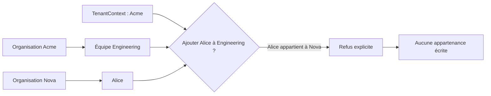
```mermaid {scale: 0.76}
flowchart LR
  A[Organisation Acme] --> E[Équipe Engineering]
  N[Organisation Nova] --> U[Alice]
  C[TenantContext : Acme] --> X{Ajouter Alice à Engineering ?}
  E --> X
  U --> X
  X -->|Alice appartient à Nova| R[Refus explicite]
  R --> Z[Aucune appartenance écrite]
```

<div class="tp-card tp-card--pulse tp-mt-3"><strong>Garantie finale</strong> : une opération bornée par Acme ne lit ni ne modifie silencieusement les données de Nova.</div>

<p class="tp-footref">Scénario pédagogique fondé sur le besoin W001-T04 ; Acme et Nova sont des organisations, Alice est une utilisatrice de Nova.</p>

<!--
**Message à faire passer**

La scène finale donne une preuve concrète à viser sans transformer toute la semaine en cours sur T04.

**Déroulé oral**

Nommez chaque élément sans ambiguïté : Acme et Nova sont deux organisations ; Engineering appartient à Acme ; Alice appartient à Nova. L'opération est exécutée dans le contexte Acme. Le résultat attendu n'est pas que Nova « n'existe pas », mais qu'Alice ne soit pas visible comme utilisatrice disponible dans ce périmètre et qu'aucune appartenance invalide ne soit écrite.

**Insister sur**

Cette scène est une acceptation future. Elle n'autorise pas à introduire les contrats de T04 dans les chapitres T01 à T03.

**Transition**

Décomposons maintenant le chemin : chaque ticket doit produire une capacité identifiable avant le suivant.
-->

---

<div class="tp-kicker">Progression · capacités cumulatives</div>

# Quatre micro-objectifs construisent W001

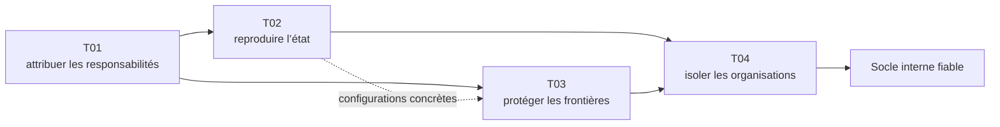
```mermaid {scale: 0.72}
flowchart LR
  T1[T01<br/>attribuer les responsabilités] --> T2[T02<br/>reproduire l’état]
  T1 --> T3[T03<br/>protéger les frontières]
  T2 -. configurations concrètes .-> T3
  T2 --> T4[T04<br/>isoler les organisations]
  T3 --> T4
  T4 --> W[Socle interne fiable]
```

<div class="tp-card tp-mt-3"><strong>Lecture</strong> : l’ordre pédagogique reste T01 → T02 → T03 → T04 ; la dépendance technique de T03 vient surtout du découpage T01.</div>

<!--
**Message à faire passer**

W001 est l'assemblage de quatre résultats, pas un long prélude à la seule isolation tenant.

**Déroulé oral**

Suivez d'abord le chemin principal. T01 donne des propriétaires. T02 aligne la propriété des données. T03 rend les règles internes exécutables. T04 utilise ces trois fondations pour introduire la première verticale tenantée. Revenez ensuite sur la flèche directe T01 vers T03 : ArchUnit n'a pas besoin de PostgreSQL pour exister, même si T02 apporte les premières configurations concrètes à protéger.

**Insister sur**

Une narration linéaire n'oblige pas à inventer une dépendance technique fausse.

**Transition**

Chaque chapitre utilisera maintenant le même contrat pour rendre son propre objectif lisible.
-->

---

<div class="tp-kicker">Contrat d’apprentissage</div>

# Chaque ticket doit changer l’état du projet

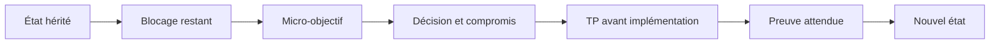
```mermaid {scale: 0.7}
flowchart LR
  H[État hérité] --> B[Blocage restant]
  B --> O[Micro-objectif]
  O --> D[Décision et compromis]
  D --> TP[TP avant implémentation]
  TP --> P[Preuve attendue]
  P --> S[Nouvel état]
```

<div class="tp-card tp-card--warn tp-mt-4"><strong>Frontière W001</strong> : pas de contrôleur HTTP, JWT, acteur authentifié, permission, OpenAPI, Row-Level Security ou coordination multi-nœud.</div>

<!-- AUTO-GENERATED:W001:END -->

<!--
**Message à faire passer**

Le fil conducteur est la transformation observable de l'état du projet, répétée à chaque ticket.

**Déroulé oral**

Présentez la boucle une seule fois. Le besoin vient avant la solution ; l'ADR conserve la décision ; le TP demande de construire sans fournir le code ; la preuve indique comment reconnaître la réussite ; le nouvel état rend la question suivante légitime. Le formateur peut ainsi reprendre la même structure sans réciter le scénario Acme/Nova à chaque slide.

**Insister sur**

Le support se place en amont de l'implémentation. Les fichiers et tests existants servent de preuve de faisabilité et de débrief, pas de raccourci à copier.

**Transition**

T01 commence avant les utilisateurs et les équipes : il faut d'abord décider qui possédera quoi.
-->

---
layout: center
class: tp-section
transition: fade
routeAlias: w001-t01
---

<!-- AUTO-GENERATED:W001-T01:START -->
<div class="tp-kicker">W001-T01 · état hérité : une application à structurer</div>

# Donner un propriétaire à chaque domaine

<div class="tp-grid-2 tp-mt-5">
  <div class="tp-card tp-card--warn"><strong>Blocage</strong><br><span class="tp-muted">Dans un module unique, une classe visible peut devenir une dépendance sans décision explicite.</span></div>
  <div class="tp-card tp-card--pulse"><strong>Micro-objectif T01</strong><br><span class="tp-muted">Conserver un seul exécutable tout en attribuant clairement les responsabilités métier.</span></div>
</div>

<div class="tp-card tp-mt-4"><strong>Sortie attendue</strong> : une carte de modules et de dépendances que le build peut vérifier.</div>

<!--
**Message à faire passer**

T01 ne définit encore aucun contrat métier concret entre Team et Identity ; il crée l'espace dans lequel ces contrats pourront apparaître proprement.

**Déroulé oral**

Revenez à l'état initial : plusieurs domaines doivent vivre dans le même backend. Le premier risque est qu'une proximité de code soit interprétée comme un droit d'accès. Formulez donc le résultat de T01 sans parler d'utilisateur, de tenant ou de base : chaque domaine a un propriétaire, les dépendances autorisées sont visibles et un seul module démarre l'application.

**Insister sur**

Une frontière est d'abord une décision de responsabilité. Les packages et les outils ne font que la matérialiser.

**Transition**

Comparons trois formes d'organisation possibles avec les contraintes de ce premier socle.
-->

---

<div class="tp-kicker">Décision guidée · forme du backend</div>

# Quel compromis répond au besoin actuel ?

<div class="tp-grid-3 tp-mt-4">
  <div class="tp-card"><strong>Un module unique</strong><br><span class="tp-muted">Simple à démarrer ; propriété et dépendances deviennent implicites.</span></div>
  <div class="tp-card"><strong>Services séparés</strong><br><span class="tp-muted">Frontières de processus ; réseau et exploitation prématurés.</span></div>
  <div class="tp-card tp-card--pulse"><strong>Monolithe modulaire</strong><br><span class="tp-muted">Un déploiement ; frontières explicites à concevoir et vérifier.</span></div>
</div>

<div class="tp-card tp-mt-4"><strong>Critère décisif</strong> : TeamPulse veut séparer les responsabilités sans payer encore le coût d’un système distribué.</div>

<!--
**Message à faire passer**

Le monolithe modulaire est un compromis contextuel, pas une règle universelle.

**Déroulé oral**

Laissez l'apprenant comparer les options avec deux contraintes : une seule unité déployable et plusieurs responsabilités métier. Le module unique satisfait la première mais affaiblit la seconde. Les services séparés renforcent la frontière de processus mais ajoutent des problèmes absents du besoin. Le monolithe modulaire accepte un travail de conception et de test des frontières en échange d'une exploitation simple.

**Insister sur**

Ne présentez pas les microservices comme une étape de maturité obligatoire. Une extraction future devra répondre à de nouvelles contraintes observables.

**Transition**

La décision doit maintenant attribuer des rôles précis aux cinq modules attendus.
-->

---

<div class="tp-kicker">Décision T01 · propriété</div>

# Cinq modules, cinq responsabilités explicites

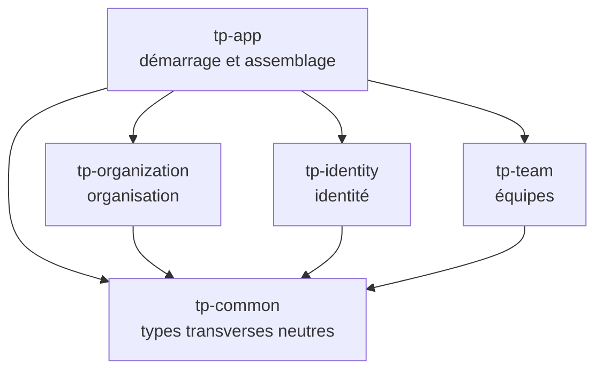
```mermaid {scale: 0.72}
flowchart TD
  APP[tp-app<br/>démarrage et assemblage]
  COM[tp-common<br/>types transverses neutres]
  ORG[tp-organization<br/>organisation]
  ID[tp-identity<br/>identité]
  TEAM[tp-team<br/>équipes]
  APP --> COM
  APP --> ORG
  APP --> ID
  APP --> TEAM
  ORG --> COM
  ID --> COM
  TEAM --> COM
```

<div class="tp-card tp-card--pulse tp-mt-3"><strong>Conclusion</strong> : <code>tp-app</code> compose, les modules métier possèdent leurs règles et <code>tp-common</code> ne devient pas un domaine caché.</div>

<!--
**Message à faire passer**

Le découpage attribue les responsabilités avant d'ajouter des classes métier.

**Déroulé oral**

Lisez le diagramme de haut en bas. `tp-app` démarre et assemble ; il ne porte pas de logique métier. Les trois modules métier peuvent utiliser des éléments réellement transverses de `tp-common`. La flèche inverse est interdite : le commun ne peut pas connaître Organization, Identity ou Team. À ce stade, aucune dépendance métier entre les trois domaines n'est nécessaire.

**Insister sur**

`tp-common` n'est pas l'endroit où déplacer ce dont le propriétaire est difficile à choisir. Il doit rester neutre et sans logique métier.

**Transition**

Cette carte doit être vraie à deux niveaux différents : le build physique et le modèle logique de l'application.
-->

---

<div class="tp-kicker">Deux frontières complémentaires</div>

# Maven assemble ; Spring Modulith interprète

<div class="tp-grid-2 tp-mt-5">
  <div class="tp-card"><strong>Maven</strong><br><span class="tp-muted">Contrôle quels artefacts peuvent compiler ensemble et lequel produit le JAR exécutable.</span></div>
  <div class="tp-card tp-card--pulse"><strong>Spring Modulith</strong><br><span class="tp-muted">Déclare les modules logiques, leurs interfaces nommées et leurs dépendances autorisées.</span></div>
</div>

<div class="tp-card tp-mt-4"><strong>Contrat</strong> : une nouvelle dépendance inter-module doit être justifiée physiquement et logiquement.</div>

<!--
**Message à faire passer**

Maven et Spring Modulith observent deux aspects différents de la même décision de propriété.

**Déroulé oral**

Maven répond à « cet artefact peut-il compiler avec cet autre ? ». Spring Modulith répond à « cette dépendance traverse-t-elle une frontière logique autorisée ? ». Une dépendance Maven seule peut être techniquement possible mais architecturalement interdite. Inversement, un modèle Modulith sans dépendance physique cohérente ne suffit pas à assembler l'application.

**Insister sur**

Le besoin ne demande pas de multiplier les outils. Il demande deux preuves différentes : l'assemblage et le respect des frontières logiques.

**Transition**

Il reste à définir ce qui pourra un jour traverser ces frontières sans publier tous les détails internes.
-->

---

<div class="tp-kicker">Préparer sans inventer le métier</div>

# Une surface publique n’est pas encore un cas d’usage

<div class="tp-grid-2 tp-mt-5">
  <div class="tp-card tp-card--pulse"><strong><code>api</code> et <code>events</code></strong><br><span class="tp-muted">Emplacements explicitement publiables pour de futurs contrats Java et faits métier.</span></div>
  <div class="tp-card"><strong><code>domain</code>, <code>application</code>, <code>infrastructure</code></strong><br><span class="tp-muted">Détails internes qui ne deviennent pas publics par commodité.</span></div>
</div>

<div class="tp-card tp-card--warn tp-mt-4"><strong>À ne pas anticiper</strong> : T01 ne crée ni <code>UserDirectory</code>, ni entité métier, ni appel Team → Identity.</div>

<!--
**Message à faire passer**

T01 prépare le mécanisme de publication sans inventer les capacités qui appartiendront aux tickets suivants.

**Déroulé oral**

Expliquez la différence entre un emplacement autorisé et un contrat réel. Les packages `api` et `events` disent où une future capacité publique pourra vivre. Ils ne justifient pas une interface vide ou un faux modèle. Cette retenue évite de dessiner T04 à l'avance et garde l'évolution pilotée par les besoins.

**Insister sur**

Une surface publique doit être volontaire et minimale. Rendre une classe Java `public` ne suffit pas à créer une API inter-module stable.

**Transition**

Nous pouvons maintenant définir la preuve exacte de T01 sans lui demander de prouver un comportement métier inexistant.
-->

---

<div class="tp-kicker">Preuve T01 · résultat structurel</div>

# Comment reconnaître une frontière réellement construite ?

<div class="tp-grid-2 tp-mt-4">
  <div class="tp-card"><strong>Comportement attendu</strong><br><span class="tp-muted"><code>tp-app</code> démarre seul et assemble les quatre modules logiques.</span></div>
  <div class="tp-card"><strong>Évidence</strong><br><span class="tp-muted">Les modules détectés sont common, organization, identity et team.</span></div>
  <div class="tp-card"><strong>Mécanisme</strong><br><span class="tp-muted">Build Maven et <code>ApplicationModules.verify()</code>.</span></div>
  <div class="tp-card tp-card--pulse"><strong>Limite</strong><br><span class="tp-muted">Cette preuve ne dit encore rien sur les tables ou l’isolation tenant.</span></div>
</div>

<p class="tp-footref">Tag de référence : W001-T01-backend-multi-module · ADR-W001-T01-backend-multi-module.md</p>

<!--
**Message à faire passer**

La preuve de T01 doit correspondre à son micro-objectif : un assemblage unique et des frontières inter-modules vérifiées.

**Déroulé oral**

Faites distinguer les trois niveaux visibles. Le comportement est ce que le système doit réussir. L'évidence est l'observation qui convainc. Le mécanisme est la commande ou le test qui produit cette observation. Cette séparation évite de confondre « nous avons un test » avec « nous avons prouvé la bonne chose ».

**Insister sur**

Une suite verte ne prouve pas encore la qualité des règles internes aux modules. Ce sera précisément l'objet de T03.

**Transition**

L'apprenant peut maintenant recevoir une mission qui ne lui fournit ni arborescence complète ni code à recopier.
-->

---

<div class="tp-kicker">TP T01 · avant implémentation</div>

# Construisez la carte des propriétaires

<div class="tp-grid-2 tp-mt-4">
  <div class="tp-card"><strong>Besoin</strong><br><span class="tp-muted">Un seul backend doit réunir trois domaines sans dépendance vers le bootstrap.</span></div>
  <div class="tp-card"><strong>À produire</strong><br><span class="tp-muted">Modules Maven, bootstrap unique, interfaces logiques et graphe autorisé.</span></div>
  <div class="tp-card"><strong>À démontrer</strong><br><span class="tp-muted">Le JAR exécutable est unique et une dépendance interdite est détectée.</span></div>
  <div class="tp-card tp-card--pulse"><strong>Débrief ADR</strong><br><span class="tp-muted">Justifier pourquoi ce compromis convient mieux que le module unique ou les services séparés.</span></div>
</div>

<div class="tp-card tp-mt-4"><strong>Nouvel état</strong> : le code possède des frontières ; l’état PostgreSQL n’est pas encore rejouable.</div>

<p class="tp-footref">Besoin : docs/besoins/W001/W001-T01-backend-multi-module.md · ADR : docs/adr/W001/ADR-W001-T01-backend-multi-module.md</p>
<!-- AUTO-GENERATED:W001-T01:END -->

<!--
**Message à faire passer**

Le TP ferme T01 avec un artefact, une preuve et une limite qui rend T02 nécessaire.

**Déroulé oral**

Demandez d'abord une carte des propriétaires et des dépendances. L'arborescence et les annotations viennent ensuite. La preuve doit échouer si le graphe autorisé est violé. Terminez par la question que T01 laisse ouverte : deux développeurs peuvent partager la même carte de code tout en travaillant sur des bases incompatibles.

**Insister sur**

La mission ne demande aucun faux cas d'usage métier. Elle prépare honnêtement leur futur emplacement.

**Transition**

T02 reprend exactement ce nouvel état : des propriétaires existent, mais ils ne possèdent pas encore une histoire de données reproductible.
-->

---
layout: center
class: tp-section
transition: fade
routeAlias: w001-t02
---

<!-- AUTO-GENERATED:W001-T02:START -->
<div class="tp-kicker">W001-T02 · état hérité : des propriétaires sans état rejouable</div>

# Aligner la propriété du code et celle des données

<div class="tp-grid-2 tp-mt-5">
  <div class="tp-card"><strong>Acquis T01</strong><br><span class="tp-muted">Organization, Identity et Team ont chacun une frontière explicite.</span></div>
  <div class="tp-card tp-card--warn"><strong>Blocage</strong><br><span class="tp-muted">Une base locale peut encore dépendre de manipulations invisibles et d’un historique partagé.</span></div>
</div>

<div class="tp-card tp-card--pulse tp-mt-4"><strong>Micro-objectif T02</strong> : repartir d’une base vide et laisser chaque module faire évoluer son espace SQL sans coordination globale des versions.</div>

<!--
**Message à faire passer**

T02 prolonge la propriété définie en T01 jusque dans l'évolution du schéma de données.

**Déroulé oral**

Faites rappeler le résultat précédent : les modules existent. Puis placez un nouveau développeur devant une machine neuve. S'il doit restaurer un dump personnel ou exécuter des commandes non documentées, la frontière du code ne suffit pas. Le nouvel objectif est double : reproduire l'environnement PostgreSQL et rendre chaque module propriétaire de son historique de migration.

**Insister sur**

T02 ne définit pas encore les tables métier. Il construit le mécanisme fiable qui permettra de les introduire plus tard.

**Transition**

Avant de comparer les options, distinguons les trois responsabilités souvent confondues sous le mot « base ».
-->

---

<div class="tp-kicker">Vocabulaire avant Flyway</div>

# Exécution, structure et évolution ne sont pas la même chose

<div class="tp-grid-3 tp-mt-4">
  <div class="tp-card"><strong>PostgreSQL</strong><br><span class="tp-muted">Exécute et persiste les données.</span></div>
  <div class="tp-card"><strong>Schéma</strong><br><span class="tp-muted">Délimite l’espace SQL appartenant à un module.</span></div>
  <div class="tp-card tp-card--pulse"><strong>Migration</strong><br><span class="tp-muted">Rejoue une évolution versionnée depuis un état connu.</span></div>
</div>

<div class="tp-card tp-mt-4"><strong>Critère de réussite</strong> : la structure doit être reconstruite par les sources, pas héritée de l’ordinateur du développeur.</div>

<!--
**Message à faire passer**

Ces trois notions répondent à des responsabilités différentes et doivent être maîtrisées avant de parler de configuration.

**Déroulé oral**

PostgreSQL fournit le moteur. Le schéma donne un espace de noms et une frontière SQL. La migration décrit le passage reproductible d'un état au suivant. Un conteneur seul ne raconte pas la structure ; un script SQL non versionné ne raconte pas l'évolution ; un schéma sans propriétaire peut devenir un espace partagé opaque.

**Insister sur**

Flyway n'est pas choisi pour « créer une base ». Il rend l'évolution du schéma déterministe et traçable.

**Transition**

Avec ce vocabulaire, comparons les formes de propriété possibles dans un monolithe modulaire.
-->

---

<div class="tp-kicker">Décision guidée · propriété SQL</div>

# Où placer l’historique des migrations ?

<div class="tp-grid-3 tp-mt-4">
  <div class="tp-card"><strong>Un schéma global</strong><br><span class="tp-muted">Simple au départ ; propriété et numérotation deviennent communes.</span></div>
  <div class="tp-card"><strong>Une base par module</strong><br><span class="tp-muted">Isolation forte ; complexité inutile pour un déploiement unique.</span></div>
  <div class="tp-card tp-card--pulse"><strong>Un schéma par module</strong><br><span class="tp-muted">Une base partagée ; migrations et historiques autonomes.</span></div>
</div>

<div class="tp-card tp-mt-4"><strong>Compromis T02</strong> : une seule connexion à opérer, mais plusieurs configurations Flyway à maintenir.</div>

<!--
**Message à faire passer**

Un schéma et un historique Flyway par module alignent la propriété SQL sur la propriété du code sans distribuer prématurément la base.

**Déroulé oral**

Évaluez les options avec trois critères : autonomie des migrations, simplicité locale et cohérence avec l'unité de déploiement. Le schéma global force une coordination inutile. Plusieurs bases isolent davantage mais ajoutent des connexions et une exploitation non demandées. Une base avec trois schémas conserve la simplicité tout en séparant les historiques.

**Insister sur**

Le schéma PostgreSQL renforce une frontière logique ; il ne transforme pas le module en service indépendant.

**Transition**

Regardons la topologie retenue et le propriétaire de chaque élément.
-->

---

<div class="tp-kicker">Décision T02 · topologie</div>

# Une base, une DataSource, trois histoires

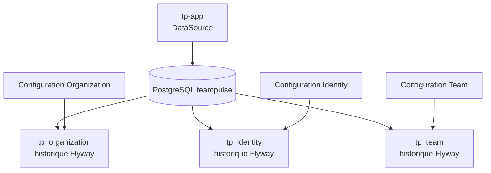
```mermaid {scale: 0.7}
flowchart TD
  APP[tp-app<br/>DataSource] --> PG[(PostgreSQL teampulse)]
  PG --> O[tp_organization<br/>historique Flyway]
  PG --> I[tp_identity<br/>historique Flyway]
  PG --> T[tp_team<br/>historique Flyway]
  OM[Configuration Organization] --> O
  IM[Configuration Identity] --> I
  TM[Configuration Team] --> T
```

<div class="tp-card tp-card--pulse tp-mt-3"><strong>Conclusion</strong> : chaque module numérote ses migrations sans demander l’autorisation aux deux autres.</div>

<!--
**Message à faire passer**

La topologie T02 conserve une infrastructure commune tout en attribuant clairement l'évolution de chaque schéma.

**Déroulé oral**

Lisez le diagramme depuis `tp-app` : une seule `DataSource` connecte l'application à PostgreSQL. Chaque module fournit ensuite sa propre configuration Flyway, son emplacement de migrations, son schéma par défaut et sa table d'historique. La numérotation peut donc recommencer dans chaque module sans collision globale.

**Insister sur**

Les requêtes croisées entre schémas resteraient un contournement de la frontière. La proximité dans la même base n'accorde aucun droit architectural.

**Transition**

Cette même topologie doit être accessible au développeur local et aux tests, sans partager leur état.
-->

---

<div class="tp-kicker">Deux usages, une même structure</div>

# Docker Compose développe ; Testcontainers prouve

<div class="tp-grid-2 tp-mt-5">
  <div class="tp-card"><strong>Développement local</strong><br><span class="tp-muted">PostgreSQL versionné, volume persistant, healthcheck et profil <code>local</code>.</span></div>
  <div class="tp-card tp-card--pulse"><strong>Tests d’intégration</strong><br><span class="tp-muted">PostgreSQL éphémère, base propre et indépendante du conteneur du développeur.</span></div>
</div>

<div class="tp-card tp-mt-4"><strong>Invariant commun</strong> : les mêmes configurations Flyway doivent réussir sur une base vide dans les deux environnements.</div>

<!--
**Message à faire passer**

Docker Compose et Testcontainers ne sont pas deux solutions concurrentes : ils servent deux usages différents avec le même contrat de structure.

**Déroulé oral**

Le développeur veut un service stable qu'il peut redémarrer sans perdre ses données. Le test veut un état jetable et isolé. Dans les deux cas, la vérité vient des migrations et de la configuration de l'application, pas du contenu préexistant. Cette distinction évite que la suite dépende du port 5432 ou des manipulations locales.

**Insister sur**

Testcontainers reste une dépendance de test. L'application de production ne doit pas le charger.

**Transition**

Définissons maintenant ce que T02 peut honnêtement prouver avant la première migration métier.
-->

---

<div class="tp-kicker">Preuve T02 · base vide</div>

# Le démarrage est déjà une preuve utile

<div class="tp-grid-2 tp-mt-4">
  <div class="tp-card"><strong>Comportement attendu</strong><br><span class="tp-muted">Une base vide reçoit les trois schémas et leurs historiques.</span></div>
  <div class="tp-card"><strong>Évidence</strong><br><span class="tp-muted">Le contexte démarre avec <code>ddl-auto=validate</code> sans création Hibernate.</span></div>
  <div class="tp-card"><strong>Mécanisme</strong><br><span class="tp-muted">Tests de contexte sur PostgreSQL Testcontainers.</span></div>
  <div class="tp-card tp-card--pulse"><strong>Limite assumée</strong><br><span class="tp-muted">Au tag T02, aucune table métier n’est encore migrée.</span></div>
</div>

<p class="tp-footref">Tag de référence : W001-T02-PostgreSQL-local-et-schemas-Flyway</p>

<!--
**Message à faire passer**

T02 prouve l'infrastructure de migration sans fabriquer une migration vide ou une table métier prématurée.

**Déroulé oral**

Expliquez pourquoi le démarrage du contexte est une preuve suffisante à ce stade : une erreur de connexion, de migration ou de validation Hibernate ferait échouer l'initialisation. Il serait trompeur d'affirmer que T02 prouve déjà les contraintes tenantées ; celles-ci n'arriveront qu'avec les premières tables de T04.

**Insister sur**

Une preuve proportionnée au ticket vaut mieux qu'une assertion détaillée qui ne couvre aucun contrat métier réel.

**Transition**

Le TP peut maintenant demander de reconstruire cette infrastructure depuis une machine neuve.
-->

---

<div class="tp-kicker">TP T02 · avant implémentation</div>

# Rejouez l’état depuis zéro

<div class="tp-grid-2 tp-mt-4">
  <div class="tp-card"><strong>Besoin</strong><br><span class="tp-muted">Chaque module doit faire évoluer son SQL sans base préinstallée ni numérotation globale.</span></div>
  <div class="tp-card"><strong>À produire</strong><br><span class="tp-muted">Compose local, DataSource, trois configurations Flyway et <code>ddl-auto=validate</code>.</span></div>
  <div class="tp-card"><strong>À démontrer</strong><br><span class="tp-muted">Base vide, démarrage local et tests isolés sur PostgreSQL réel.</span></div>
  <div class="tp-card tp-card--pulse"><strong>Débrief ADR</strong><br><span class="tp-muted">Expliquer le coût accepté de plusieurs configurations Flyway.</span></div>
</div>

<div class="tp-card tp-mt-4"><strong>Nouvel état</strong> : code et migrations ont des propriétaires ; les conventions internes restent seulement déclaratives.</div>

<p class="tp-footref">Besoin : docs/besoins/W001/W001-T02-PostgreSQL-local-et-schemas-Flyway.md · ADR : docs/adr/W001/ADR-W001-T02-docker-compose-local.md</p>
<!-- AUTO-GENERATED:W001-T02:END -->

<!--
**Message à faire passer**

Le TP T02 construit une réalité de données commune et termine sur la prochaine faiblesse : rien n'empêche encore une classe future de traverser les couches.

**Déroulé oral**

Demandez une démonstration reproductible, pas une capture d'écran d'une base locale. L'apprenant doit pouvoir supprimer l'état, relancer puis expliquer quel module crée quel schéma et quel historique. Le débrief compare le compromis retenu aux deux alternatives. Terminez en rappelant que les modules sont encore presque vides : leur structure interne peut dériver dès l'arrivée du premier vrai code.

**Insister sur**

T02 prépare les migrations métier ; il ne doit pas inventer les tables de T04.

**Transition**

T03 transforme maintenant les conventions internes en signaux de build avant que les classes métier se multiplient.
-->

---
layout: center
class: tp-section
transition: fade
routeAlias: w001-t03
---

<!-- AUTO-GENERATED:W001-T03:START -->
<div class="tp-kicker">W001-T03 · état hérité : des frontières encore déclaratives</div>

# Faire échouer les raccourcis d’architecture

<div class="tp-grid-2 tp-mt-5">
  <div class="tp-card"><strong>Acquis T01–T02</strong><br><span class="tp-muted">Les modules possèdent leur code, leur schéma et leur historique de migration.</span></div>
  <div class="tp-card tp-card--warn"><strong>Blocage</strong><br><span class="tp-muted">Une classe future peut encore dépendre de JPA, de Spring ou d’un adapter depuis la mauvaise couche.</span></div>
</div>

<div class="tp-card tp-card--pulse tp-mt-4"><strong>Micro-objectif T03</strong> : transformer la direction des dépendances internes en règles exécutables avant l’arrivée du vrai métier.</div>

<!--
**Message à faire passer**

T03 ne redessine pas les modules ; il protège leur organisation interne avant que les mauvaises dépendances deviennent coûteuses à retirer.

**Déroulé oral**

Rappelez que T01 contrôle surtout les frontières entre modules. À l'intérieur d'Identity, Organization ou Team, rien n'empêche encore le domaine de connaître JPA ou l'application d'appeler directement une implémentation de persistence. Ces erreurs compilent souvent. Le besoin est donc d'obtenir un signal précoce et compréhensible au moment du build.

**Insister sur**

Une convention écrite reste utile, mais elle ne fournit pas seule de retour automatique au développeur.

**Transition**

Observons les dérives concrètes que la compilation Java laisserait passer.
-->

---

<div class="tp-kicker">Symptômes · le code compile encore</div>

# Quatre dépendances qui installent une dette silencieuse

<div class="tp-grid-2 tp-mt-4">
  <div class="tp-card"><strong>Domaine → JPA</strong><br><span class="tp-muted">Le modèle métier devient dépendant de sa persistence.</span></div>
  <div class="tp-card"><strong>Application → Spring Data</strong><br><span class="tp-muted">Le cas d’usage contourne son port sortant.</span></div>
  <div class="tp-card"><strong>Web → persistence</strong><br><span class="tp-muted">Le transport orchestre directement les données.</span></div>
  <div class="tp-card"><strong>API publique → interne</strong><br><span class="tp-muted">Le consommateur dépend d’un détail impossible à stabiliser.</span></div>
</div>

<div class="tp-card tp-card--warn tp-mt-4"><strong>Conséquence</strong> : la structure paraît correcte dans les dossiers, mais la direction réelle des dépendances est inversée.</div>

<!--
**Message à faire passer**

Une architecture se lit dans les dépendances réelles, pas dans le nom des packages.

**Déroulé oral**

Parcourez les quatre exemples et demandez lequel serait détecté par le compilateur. Tous peuvent compiler si les dépendances sont présentes. Le défaut devient visible plus tard : test difficile, changement de persistence coûteux, règle dupliquée ou contrat public instable. T03 cherche à faire remonter ce signal au moment où le raccourci est introduit.

**Insister sur**

ArchUnit ne décide pas de l'architecture. Il exécute une décision préalablement comprise et documentée.

**Transition**

Avant d'écrire des règles, attribuons chaque type d'écart au garde-fou qui l'explique le mieux.
-->

---

<div class="tp-kicker">Trois gardes · trois périmètres</div>

# Quel outil doit signaler quel écart ?

<div class="tp-grid-3 tp-mt-4">
  <div class="tp-card"><strong>Maven</strong><br><span class="tp-muted">Dépendances physiques entre artefacts et scopes.</span></div>
  <div class="tp-card"><strong>Spring Modulith</strong><br><span class="tp-muted">Frontières et interfaces autorisées entre modules métier.</span></div>
  <div class="tp-card tp-card--pulse"><strong>ArchUnit</strong><br><span class="tp-muted">Placement et direction des dépendances à l’intérieur d’un module.</span></div>
</div>

<div class="tp-card tp-mt-4"><strong>Principe</strong> : ne pas dupliquer une règle si un garde-fou plus proche du problème fournit déjà un meilleur diagnostic.</div>

<!--
**Message à faire passer**

La complémentarité des outils vient de leurs périmètres, pas du nombre de tests que l'équipe souhaite accumuler.

**Déroulé oral**

Donnez trois écarts : une dépendance Maven interdite, Team qui consomme un package non publié d'Identity, puis un domaine qui importe JPA. Faites associer respectivement Maven, Modulith et ArchUnit. Le même build peut échouer, mais le message et la correction attendue ne sont pas les mêmes.

**Insister sur**

Un test d'architecture structurel ne prouve ni une transition métier ni une contrainte PostgreSQL.

**Transition**

ArchUnit a maintenant besoin d'une cible : la direction interne choisie pour chaque module métier.
-->

---

<div class="tp-kicker">Structure cible · dépendances vers le cœur</div>

# L’infrastructure dépend du métier, jamais l’inverse

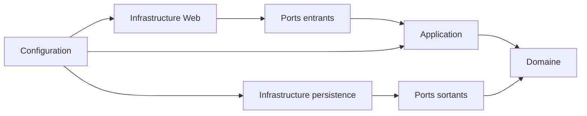
```mermaid {scale: 0.72}
flowchart LR
  WEB[Infrastructure Web] --> IN[Ports entrants]
  PERS[Infrastructure persistence] --> OUT[Ports sortants]
  IN --> APP[Application]
  APP --> DOM[Domaine]
  OUT --> DOM
  CFG[Configuration] --> APP
  CFG --> WEB
  CFG --> PERS
```

<div class="tp-card tp-card--pulse tp-mt-3"><strong>Conclusion</strong> : le cœur exprime le métier et les contrats ; les adapters connaissent le cœur pour s’y brancher.</div>

<!--
**Message à faire passer**

La direction des dépendances protège la capacité du domaine et de l'application à évoluer sans connaître leurs adapters.

**Déroulé oral**

Lisez les flèches vers le cœur. Le Web appelle un port entrant. La persistence implémente un port sortant. L'application orchestre et dépend du domaine. La configuration assemble. Aucune flèche ne part du domaine vers Spring, JPA, un contrôleur ou une configuration technique.

**Insister sur**

Le placement des ports dans `application.port.in` et `application.port.out` exprime qu'ils appartiennent aux cas d'usage, pas aux adapters.

**Transition**

Le catalogue T03 traduit cette structure en familles de règles lisibles.
-->

---

<div class="tp-kicker">Décision T03 · catalogue commun</div>

# Dix règles, quatre intentions

<div class="tp-grid-2 tp-mt-4">
  <div class="tp-card"><strong>R01–R02 · cœur</strong><br><span class="tp-muted">Domaine pur et dépendances orientées vers lui.</span></div>
  <div class="tp-card"><strong>R03–R06 · adapters</strong><br><span class="tp-muted">Ports possédés par l’application, Web et persistence isolés.</span></div>
  <div class="tp-card"><strong>R07–R09 · structure</strong><br><span class="tp-muted">Surface publique, placement technique et absence de cycles.</span></div>
  <div class="tp-card tp-card--pulse"><strong>R10 · cohérence</strong><br><span class="tp-muted">Le même catalogue s’applique à tous les modules métier.</span></div>
</div>

<div class="tp-card tp-mt-4"><strong>Compromis</strong> : le catalogue devra évoluer si une nouvelle zone technique apparaît, mais aucune exception locale ne sera silencieuse.</div>

<!--
**Message à faire passer**

Le catalogue commun empêche trois variantes implicites de l'architecture dans Identity, Organization et Team.

**Déroulé oral**

Présentez les intentions avant les numéros. Le cœur reste libre des frameworks. Les adapters passent par les ports. Les types techniques restent au bon endroit et les cycles sont interdits. Enfin, R10 vérifie que chaque module reçoit le même ensemble de règles. L'objectif n'est pas de mémoriser dix identifiants, mais de savoir quelle responsabilité chacun protège.

**Insister sur**

Une exception peut être nécessaire un jour ; elle doit alors être nommée, justifiée et suivie, jamais ajoutée pour faire repasser le build.

**Transition**

Une difficulté subsiste : comment prouver des règles lorsque les futurs packages sont encore vides ?
-->

---

<div class="tp-kicker">Limite honnête · packages vides</div>

# Une règle sans cible n’est pas encore une preuve

<div class="tp-grid-2 tp-mt-5">
  <div class="tp-card"><strong>Choix retenu</strong><br><span class="tp-muted">Autoriser temporairement l’absence de classe cible et ne créer aucun faux code de production.</span></div>
  <div class="tp-card tp-card--warn"><strong>Risque</strong><br><span class="tp-muted">Une suite verte peut donner l’impression qu’une architecture vide a déjà été entièrement validée.</span></div>
</div>

<div class="tp-card tp-card--pulse tp-mt-4"><strong>Réponse</strong> : provoquer une violation représentative, constater l’échec, retirer la violation puis attendre que T04 active réellement les règles.</div>

<!--
**Message à faire passer**

T03 prouve le fonctionnement du garde-fou, pas encore la conformité d'un ensemble de classes métier qui n'existe pas.

**Déroulé oral**

Expliquez pourquoi une classe factice serait une mauvaise preuve : elle polluerait la production pour satisfaire le test. La stratégie retenue accepte des règles sans cible mais documente cette limite. Une violation temporaire démontre que le mécanisme détecte réellement un écart. T04 fournira ensuite les classes réelles sur lesquelles les règles s'exerceront durablement.

**Insister sur**

Une absence d'échec n'est pas automatiquement une preuve positive. Il faut connaître la population effectivement analysée.

**Transition**

La validation de T03 doit donc contenir un aller-retour rouge puis vert.
-->

---

<div class="tp-kicker">Preuve T03 · échec contrôlé</div>

# Le bon signal avant le retour au vert

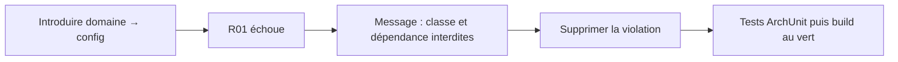
```mermaid {scale: 0.7}
flowchart LR
  V[Introduire domaine → config] --> R[R01 échoue]
  R --> M[Message : classe et dépendance interdites]
  M --> C[Supprimer la violation]
  C --> G[Tests ArchUnit puis build au vert]
```

<div class="tp-card tp-mt-3"><strong>Comportement prouvé</strong> : une dépendance interne contraire à la décision ne peut pas s’installer silencieusement.</div>

<p class="tp-footref">Tag de référence : W001-T03-regles-architecture-archunit · ADR-W001-T03-regles-architecture-archunit.md</p>

<!--
**Message à faire passer**

Le passage rouge puis vert démontre la sensibilité du garde-fou et la qualité de son diagnostic.

**Déroulé oral**

Faites raconter la séquence avant de montrer le mécanisme. Une classe du domaine dépend volontairement d'une configuration. R01 doit échouer en nommant la classe et la dépendance. Après suppression, les tests d'architecture puis le build complet reviennent au vert. Le test ne démarre ni Spring Boot, ni PostgreSQL, ni Testcontainers, car il inspecte la structure du bytecode.

**Insister sur**

Le retour au vert n'efface pas la limite des packages vides. Il prouve que le filet réagit lorsqu'une classe réelle le traverse.

**Transition**

Le TP demande maintenant à l'apprenant de produire ce diagnostic, pas simplement d'ajouter ArchUnit au pom.
-->

---

<div class="tp-kicker">TP T03 · avant implémentation</div>

# Rendez la convention falsifiable

<div class="tp-grid-2 tp-mt-4">
  <div class="tp-card"><strong>Besoin</strong><br><span class="tp-muted">Les futurs domaines et adapters doivent respecter la même direction de dépendances.</span></div>
  <div class="tp-card"><strong>À produire</strong><br><span class="tp-muted">Découverte dynamique des modules et catalogue partagé R01–R10.</span></div>
  <div class="tp-card"><strong>À démontrer</strong><br><span class="tp-muted">Une violation contrôlée échoue avec un diagnostic exploitable, puis le build redevient vert.</span></div>
  <div class="tp-card tp-card--pulse"><strong>Débrief ADR</strong><br><span class="tp-muted">Expliquer pourquoi ArchUnit complète Maven et Modulith sans les dupliquer.</span></div>
</div>

<div class="tp-card tp-mt-4"><strong>Nouvel état</strong> : modules, données et règles sont prêts ; aucune verticale métier tenantée n’existe encore.</div>

<p class="tp-footref">Besoin : docs/besoins/W001/W001-T03-regles-architecture-archunit.md · ADR : docs/adr/W001/ADR-W001-T03-regles-architecture-archunit.md</p>
<!-- AUTO-GENERATED:W001-T03:END -->

<!--
**Message à faire passer**

T03 ferme le socle structurel et rend enfin légitime l'arrivée du premier code métier réel.

**Déroulé oral**

Le TP doit commencer par une matrice de dépendances autorisées, puis seulement être traduite en règles. L'apprenant vérifie une violation représentative et explique le périmètre de chaque garde-fou. Terminez par l'état atteint : T01 à T03 ont préparé et protégé le terrain, mais ils ne savent toujours pas pour quelle organisation un cas d'usage s'exécute.

**Insister sur**

Un build parfaitement structuré pourrait encore accepter une opération inter-tenant incohérente. La structure ne remplace pas le comportement.

**Transition**

T04 peut maintenant introduire Acme, Nova, Alice et la première verticale métier sans contourner les fondations précédentes.
-->

---
layout: center
class: tp-section
transition: fade
routeAlias: w001-t04
---

<!-- AUTO-GENERATED:W001-T04:START -->
<div class="tp-kicker">W001-T04 · état hérité : un socle prêt pour le métier</div>

# Pour quelle organisation l’opération agit-elle ?

<div class="tp-grid-2 tp-mt-4">
  <div class="tp-card"><strong>Acquis T01–T03</strong><br><span class="tp-muted">Propriétaires explicites, PostgreSQL rejouable et dépendances internes surveillées.</span></div>
  <div class="tp-card tp-card--warn"><strong>Blocage</strong><br><span class="tp-muted">Aucun contrat n’oblige encore un cas d’usage à porter son périmètre d’organisation.</span></div>
</div>

<div class="tp-card tp-card--pulse tp-mt-4"><strong>Micro-objectif T04</strong> : construire une première verticale interne tenantée et prouver qu’une opération Acme ne traverse pas vers Nova.</div>

<!--
**Message à faire passer**

T04 est le premier ticket qui introduit un comportement métier tenanté ; il active réellement les fondations construites auparavant.

**Déroulé oral**

Faites rappeler les trois acquis sans rejouer toute la semaine. Ils répondent à la propriété, à la reproductibilité et à la durabilité de l'architecture. La question restante est différente : le cas d'usage doit savoir dans quel périmètre il recherche et modifie les données. T04 apporte ce sens métier dans les modèles, les ports, l'orchestration et la persistence.

**Insister sur**

La présence de schémas séparés par module ne sépare pas automatiquement deux organisations stockées dans un même module.

**Transition**

Reprenons la scène d'acceptation avec des acteurs et des appartenances désormais explicites.
-->

---

<div class="tp-kicker">Scène T04 · acteurs explicites</div>

# Alice appartient à Nova, pas à Acme

<div class="tp-grid-2 tp-mt-4">
  <div class="tp-card"><strong>Organisation Acme</strong><br><span class="tp-muted">Possède l’équipe Engineering.</span></div>
  <div class="tp-card"><strong>Organisation Nova</strong><br><span class="tp-muted">Possède l’utilisatrice Alice.</span></div>
  <div class="tp-card"><strong>Contexte</strong><br><span class="tp-muted">L’opération s’exécute pour Acme.</span></div>
  <div class="tp-card tp-card--warn"><strong>Demande invalide</strong><br><span class="tp-muted">Ajouter Alice à Engineering.</span></div>
</div>

<div class="tp-card tp-card--pulse tp-mt-4"><strong>Acceptation</strong> : Alice n’est pas révélée comme disponible dans Acme ; aucune appartenance n’est créée.</div>

<!--
**Message à faire passer**

Le scénario sépare clairement l'organisation cible, l'équipe et l'utilisatrice afin que le refus soit compréhensible avant toute solution technique.

**Déroulé oral**

Faites reformuler la scène par l'apprenant. Acme et Nova sont les tenants. Engineering appartient à Acme. Alice appartient à Nova. La présence d'Alice dans l'application ne lui donne aucune existence utilisable dans le périmètre Acme. La demande doit être refusée sans révéler inutilement qu'une référence appartient à une autre organisation.

**Insister sur**

Le comportement attendu est « introuvable dans ce périmètre », pas « trouvée ailleurs puis interdite ». Cette nuance limite la divulgation inter-tenant.

**Transition**

Ce résultat final exige plusieurs sous-capacités ; T04 doit les construire dans un ordre compréhensible.
-->

---

<div class="tp-kicker">Progression interne T04</div>

# Six micro-objectifs avant la preuve

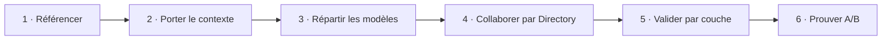
```mermaid {scale: 0.68}
flowchart LR
  R[1 · Référencer] --> C[2 · Porter le contexte]
  C --> M[3 · Répartir les modèles]
  M --> D[4 · Collaborer par Directory]
  D --> V[5 · Valider par couche]
  V --> P[6 · Prouver A/B]
```

<div class="tp-card tp-mt-3"><strong>Fil T04</strong> : identifier sans coupler, borner l’exécution, distribuer les responsabilités, puis composer les garanties.</div>

<!--
**Message à faire passer**

T04 n'est pas une décision unique autour de TenantContext ; c'est une chaîne de capacités dont chacune retire un risque distinct.

**Déroulé oral**

Parcourez les six étapes sans détailler leur solution. Une référence permet de désigner une donnée au-delà de son module. Le contexte borne le cas d'usage. Les modèles attribuent les règles. Les directories organisent la collaboration. La validation est répartie selon la connaissance de chaque couche. Enfin, plusieurs preuves montrent que l'ensemble tient.

**Insister sur**

L'ordre évite de présenter un type Java comme une solution magique. TenantContext ne peut rien garantir si les repositories et collaborations ignorent le tenant.

**Transition**

Commençons par la valeur qui doit franchir les frontières sans exposer la persistence d'Organization.
-->

---

<div class="tp-kicker">Décision guidée · identité inter-module</div>

# Comment désigner une organisation hors de son module ?

<div class="tp-grid-3 tp-mt-4">
  <div class="tp-card"><strong><code>BIGINT</code> interne</strong><br><span class="tp-muted">Compact ; couple tous les modules à l’identité de persistence d’Organization.</span></div>
  <div class="tp-card"><strong>UUID générique</strong><br><span class="tp-muted">Opaque et distribué ; ne porte aucun vocabulaire TeamPulse.</span></div>
  <div class="tp-card tp-card--pulse"><strong>Référence fonctionnelle</strong><br><span class="tp-muted">Stable, opaque pour le consommateur et reconnaissable par préfixe.</span></div>
</div>

<div class="tp-card tp-mt-4"><strong>Décision</strong> : <code>Organization.reference</code> identifie le tenant dans les contrats ; le <code>Long</code> reste strictement local à la persistence.</div>

<!--
**Message à faire passer**

La séparation entre identifiant technique et référence fonctionnelle protège l'autonomie du module propriétaire.

**Déroulé oral**

Comparez les options avec le critère principal : un autre module doit-il connaître la manière dont Organization persiste ses lignes ? Le `BIGINT` répond non. L'UUID résout le couplage mais n'apporte pas le format métier retenu par TeamPulse. La référence fonctionnelle reste une valeur opaque pour le consommateur, même si son préfixe aide au diagnostic.

**Insister sur**

« Fonctionnelle » ne signifie pas modifiable par l'utilisateur ni porteuse de toutes les règles métier. La valeur reste générée et stable.

**Transition**

Le format choisi doit annoncer clairement ses garanties et surtout ses limites.
-->

---

<div class="tp-kicker">Approfondissement borné · références</div>

# Une garantie mono-JVM, pas une promesse universelle

<div class="tp-grid-2 tp-mt-4">
  <div class="tp-card"><strong>Format</strong><br><span class="tp-muted"><code>ORG|USR|TEM-année-jour/mois-suffixe base36</code> ; validation Java stricte.</span></div>
  <div class="tp-card"><strong>Dans une JVM</strong><br><span class="tp-muted">Temps logique, nonce de démarrage et compteur atomique.</span></div>
  <div class="tp-card"><strong>Dernière défense</strong><br><span class="tp-muted">Contrainte <code>UNIQUE</code> PostgreSQL ; collision traduite explicitement.</span></div>
  <div class="tp-card tp-card--warn"><strong>Limite</strong><br><span class="tp-muted">La coordination multi-nœud devra être redécidée avant Kubernetes.</span></div>
</div>

<div class="tp-card tp-mt-3"><strong>Condition de révision</strong> : plusieurs instances productrices de références exigeraient une identité de nœud ou une coordination partagée.</div>

<!--
**Message à faire passer**

Le générateur est un approfondissement de la décision de référence ; il ne doit pas détourner le chapitre de l'isolation tenant.

**Déroulé oral**

Présentez seulement les garanties utiles au raisonnement principal. La factory génère des références monotones et thread-safe dans une JVM. Le nonce limite la collision après redémarrage et PostgreSQL conserve une contrainte unique. La promesse n'est pas distribuée : plusieurs nœuds changeraient les hypothèses et déclencheraient une nouvelle décision.

**Insister sur**

Les calculs base 36, le recul d'horloge et le débordement du compteur peuvent être traités en approfondissement sans bloquer la compréhension du tenant.

**Transition**

Une référence désigne l'organisation ; elle ne dit pas encore pour quelle organisation le cas d'usage s'exécute.
-->

---

<div class="tp-kicker">Vocabulaire · ne pas confondre les questions</div>

# Tenant, acteur et ressource sont trois informations

<div class="tp-grid-3 tp-mt-4">
  <div class="tp-card tp-card--pulse"><strong>Tenant</strong><br><span class="tp-muted">Pour quelle organisation l’opération s’exécute-t-elle ?</span></div>
  <div class="tp-card"><strong>Acteur</strong><br><span class="tp-muted">Qui demande l’action et avec quelles permissions ?</span></div>
  <div class="tp-card"><strong>Ressource</strong><br><span class="tp-muted">Quelle équipe, quel utilisateur ou quelle appartenance est ciblé ?</span></div>
</div>

<div class="tp-card tp-card--warn tp-mt-4"><strong>Périmètre T04</strong> : le tenant et les ressources sont modélisés ; l’acteur authentifié, JWT et les permissions restent hors scope.</div>

<!--
**Message à faire passer**

Le tenant borne les données ; il ne prouve ni l'identité ni l'autorisation de la personne qui appelle.

**Déroulé oral**

Posez successivement les trois questions. Dans la scène, Acme est le tenant, un futur utilisateur connecté sera l'acteur et Engineering/Alice sont les ressources. T04 peut construire la cohérence des données sans prétendre savoir qui appelle l'application. Cette séparation évite de charger TenantContext de responsabilités de sécurité qu'il ne pourra pas tenir.

**Insister sur**

L'absence de JWT n'autorise pas à rendre le tenant facultatif. Elle impose seulement de garder la résolution réelle du contexte pour un ticket ultérieur.

**Transition**

Le contrat doit maintenant rendre l'absence du tenant visible dans chaque opération concernée.
-->

---

<div class="tp-kicker">Décision T04 · contexte obligatoire</div>

# `TenantContext` borne le cas d’usage

<div class="tp-grid-3 tp-mt-4">
  <div class="tp-card"><strong>Référence dans chaque commande</strong><br><span class="tp-muted">Facile à dupliquer, inventer ou confondre avec une ressource.</span></div>
  <div class="tp-card"><strong>Contexte plateforme vide</strong><br><span class="tp-muted">Ajoute un type sans garantir le périmètre tenanté.</span></div>
  <div class="tp-card tp-card--pulse"><strong><code>TenantContext</code> non nul</strong><br><span class="tp-muted">La signature annonce explicitement l’organisation d’exécution.</span></div>
</div>

```java
User create(@NotNull TenantContext tenantContext,
            @NotNull @Valid CreateUserCommand command);
```

<div class="tp-card tp-mt-3"><strong>Compromis</strong> : les signatures sont plus explicites et plus longues ; aucune opération tenantée globale n’est tolérée.</div>

<!--
**Message à faire passer**

TenantContext rend le périmètre obligatoire dans le contrat d'application, sans devenir une autorisation de sécurité.

**Déroulé oral**

Comparez les trois options. Une référence placée librement dans chaque commande mélange contexte et données d'entrée. Un contexte vide ne protège rien. Un `TenantContext` validé rend l'absence du tenant impossible à ignorer dans la signature. En W001, sa `tenantReference` contient `Organization.reference`, puis le service la propage sous le nom métier `organizationReference`.

**Insister sur**

La commande ne doit pas transporter une seconde organisation contradictoire. Le tenant est résolu une fois puis transmis.

**Transition**

Une fois le périmètre explicite, chaque module doit posséder les modèles et règles qui lui reviennent.
-->

---

<div class="tp-kicker">Propriété métier · quatre modèles</div>

# Chaque module protège ce qu’il connaît

<div class="tp-grid-2 tp-mt-4">
  <div class="tp-card"><strong>Organization</strong><br><span class="tp-muted">Référence du tenant, statut et responsables.</span></div>
  <div class="tp-card"><strong>User</strong><br><span class="tp-muted">Organisation d’appartenance, identité et disponibilité.</span></div>
  <div class="tp-card"><strong>Team</strong><br><span class="tp-muted">Organisation, responsables et cycle de vie de l’équipe.</span></div>
  <div class="tp-card tp-card--pulse"><strong>TeamMember</strong><br><span class="tp-muted">Relation tenantée entre une équipe locale et une référence utilisateur externe.</span></div>
</div>

<div class="tp-card tp-mt-4"><strong>Règle</strong> : un module conserve l’identifiant technique de ses propres entités ; les frontières utilisent des références fonctionnelles.</div>

<!--
**Message à faire passer**

Le modèle est distribué par responsabilité : aucun agrégat central ne possède toute la vérité du scénario.

**Déroulé oral**

Organization possède l'existence et le statut de l'organisation. Identity possède l'utilisateur. Team possède l'équipe et ses appartenances. `TeamMember` peut utiliser le `teamId` parce que Team en est propriétaire, mais il ne possède pas le `userId` d'Identity : il conserve une `userReference`. Tous les modèles tenantés portent `organizationReference`.

**Insister sur**

Copier une référence externe ne copie pas l'entité distante. Le module consommateur ne reconstruit ni son statut ni ses règles.

**Transition**

Quand Team a besoin d'une information détenue ailleurs, il doit demander une capacité publique ciblée.
-->

---

<div class="tp-kicker">Collaboration inter-module · capacité publique</div>

# Les directories répondent sans céder leurs détails

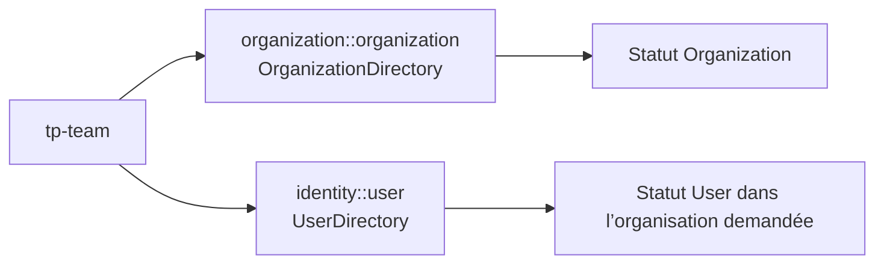
```mermaid {scale: 0.7}
flowchart LR
  TEAM[tp-team] --> OD[organization::organization<br/>OrganizationDirectory]
  TEAM --> UD[identity::user<br/>UserDirectory]
  OD --> ORG[Statut Organization]
  UD --> USER[Statut User dans l’organisation demandée]
```

<div class="tp-grid-2 tp-mt-3">
  <div class="tp-card"><strong>Résultat métier</strong><br><span class="tp-muted"><code>AVAILABLE</code>, <code>PENDING</code>, <code>UNAVAILABLE</code> ou <code>NOT_FOUND</code>.</span></div>
  <div class="tp-card tp-card--pulse"><strong>Défaillance technique</strong><br><span class="tp-muted">Exception publique dédiée, traduite par le module consommateur.</span></div>
</div>

<!--
**Message à faire passer**

T04 concrétise enfin la surface publique préparée en T01 : un contrat étroit répond à une question sans exposer le domaine ou la persistence.

**Déroulé oral**

`UserDirectory` reçoit l'organisation et la référence utilisateur. S'il existe seulement dans Nova alors que la demande porte Acme, il retourne `NOT_FOUND`. `OrganizationDirectory` transforme le statut interne en disponibilité. Team consomme ces résultats et les traduit dans son propre vocabulaire d'erreur.

**Insister sur**

Un résultat métier prévisible n'est pas une panne technique. Les enums d'availability et les exceptions publiques gardent cette différence visible.

**Transition**

Suivons maintenant l'orchestration complète de l'ajout d'Alice pour voir où le refus intervient.
-->

---

<div class="tp-kicker">Exemple guidé · orchestration</div>

# Le refus doit précéder l’écriture

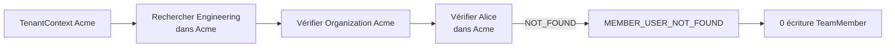
```mermaid {scale: 0.66}
flowchart LR
  C[TenantContext Acme] --> T[Rechercher Engineering<br/>dans Acme]
  T --> O[Vérifier Organization Acme]
  O --> U[Vérifier Alice<br/>dans Acme]
  U -->|NOT_FOUND| R[MEMBER_USER_NOT_FOUND]
  R --> Z[0 écriture TeamMember]
```

<div class="tp-card tp-mt-3"><strong>Fail-fast</strong> : chaque refus connu arrête l’orchestration avant la création de l’appartenance.</div>

<!--
**Message à faire passer**

Le contexte borne toutes les recherches ; la disponibilité d'Alice est évaluée dans Acme, jamais globalement puis filtrée après coup.

**Déroulé oral**

Lisez le flux de gauche à droite. Le service trouve d'abord l'équipe avec le couple organisation/référence. Il vérifie ensuite l'organisation et l'utilisateur via les directories. Pour Alice, `UserDirectory.check(Acme, Alice)` retourne `NOT_FOUND` car sa ligne appartient à Nova. Team traduit ce résultat et n'appelle pas le repository d'écriture.

**Insister sur**

L'ordre sert à éviter des I/O et écritures inutiles, mais chaque invariant durable reste garanti dans sa couche propriétaire.

**Transition**

Cette orchestration distribue la validation ; aucune couche ne peut posséder seule toute la garantie.
-->

---

<div class="tp-kicker">Validation · responsabilité la plus profonde</div>

# Quatre couches, quatre connaissances différentes

<div class="tp-grid-4 tp-mt-4">
  <div class="tp-card"><strong>Contrat</strong><br><span class="tp-muted">Présence, <code>@Valid</code>, contexte non nul.</span></div>
  <div class="tp-card"><strong>Application</strong><br><span class="tp-muted">Repositories, directories et orchestration.</span></div>
  <div class="tp-card"><strong>Domaine</strong><br><span class="tp-muted">Formats, invariants et transitions locales.</span></div>
  <div class="tp-card tp-card--pulse"><strong>PostgreSQL</strong><br><span class="tp-muted">Non-nullité, unicité, FK et temporalité persistantes.</span></div>
</div>

<div class="tp-card tp-mt-4"><strong>Principe</strong> : une validation anticipée améliore le retour ; elle ne remplace jamais la garantie de la couche propriétaire.</div>

<!--
**Message à faire passer**

La validation est répartie selon la connaissance disponible, pas regroupée dans une classe générique.

**Déroulé oral**

Le contrat vérifie la structure des entrées. L'application peut interroger des repositories et directories. Le domaine garantit qu'aucune construction ou transition locale ne produit un état invalide. PostgreSQL protège les invariants persistants qu'il sait exprimer. Une disponibilité inter-module ne peut pas être confiée à une contrainte SQL locale ; une unicité persistante ne doit pas reposer seulement sur un `if` applicatif.

**Insister sur**

Évitez `ValidationUtils` ou un validateur par entité. Une règle reste près du concept ou de la collaboration qu'elle protège.

**Transition**

La persistence doit maintenant rendre le tenant impossible à oublier dans ses clés et ses requêtes.
-->

---

<div class="tp-kicker">Persistence · dernière défense locale</div>

# L’appartenance porte aussi la frontière tenant

```sql
FOREIGN KEY (team_id, organization_reference)
  REFERENCES teams (id, organization_reference);

CREATE UNIQUE INDEX uk_team_members_current
  ON team_members (organization_reference, team_id, user_reference)
  WHERE status IN ('INVITED', 'ACTIVE', 'SUSPENDED');
```

<div class="tp-grid-2 tp-mt-3">
  <div class="tp-card"><strong>FK composite</strong><br><span class="tp-muted">L’équipe et l’appartenance doivent appartenir à la même organisation.</span></div>
  <div class="tp-card tp-card--pulse"><strong>Unicité tenantée</strong><br><span class="tp-muted">Une seule appartenance courante par organisation, équipe et utilisateur.</span></div>
</div>

<!--
**Message à faire passer**

PostgreSQL protège les relations locales que le module Team possède, sans prétendre connaître toute la vérité d'Identity.

**Déroulé oral**

La clé étrangère composite associe `team_id` à la même `organization_reference` que la ligne d'appartenance. L'index partiel empêche deux appartenances courantes pour le même triplet. En revanche, aucune FK ne pointe vers la table Identity : Team ne possède pas cette persistence et valide la disponibilité par `UserDirectory`.

**Insister sur**

La base complète l'orchestration ; elle ne connaît ni l'autorisation future de l'acteur ni les statuts distants en temps réel.

**Transition**

La preuve finale doit donc assembler plusieurs observations au lieu de chercher un test unique qui ferait tout.
-->

---

<div class="tp-kicker">Preuve T04 · faisceau complémentaire</div>

# Aucune preuve unique ne porte toute la garantie

<div class="tp-grid-2 tp-mt-4">
  <div class="tp-card"><strong>Identity</strong><br><span class="tp-muted"><code>doesNotDiscloseUserFromAnotherOrganization</code> retourne <code>NOT_FOUND</code>.</span></div>
  <div class="tp-card"><strong>Team</strong><br><span class="tp-muted"><code>isolatesMembershipOperationsFromAnotherTenant</code> refuse avant tout appel aux directories et toute écriture.</span></div>
  <div class="tp-card"><strong>PostgreSQL</strong><br><span class="tp-muted">Contraintes tenantées, composites, d’unicité et de temporalité sur base réelle.</span></div>
  <div class="tp-card tp-card--pulse"><strong>Architecture</strong><br><span class="tp-muted">Modulith et ArchUnit empêchent les raccourcis inter-module et les inversions de couches.</span></div>
</div>

<div class="tp-card tp-card--warn tp-mt-3"><strong>Honnêteté</strong> : les ITs de module mockent les directories externes ; le scénario complet est prouvé par composition, pas par un faux end-to-end unique.</div>

<!--
**Message à faire passer**

La crédibilité de T04 vient de la correspondance entre chaque garantie et la preuve capable de l'observer.

**Déroulé oral**

Le test Identity démontre la non-divulgation d'un utilisateur d'un autre tenant. Le test Team démontre qu'un tenant étranger ne retrouve pas l'équipe et n'écrit rien. Les tests PostgreSQL couvrent les contraintes locales. Les tests d'architecture couvrent les frontières. Les tests de module remplacent les collaborations externes par des doubles ; il serait donc inexact de les présenter comme un seul parcours HTTP-to-database.

**Insister sur**

Le nombre total de tests ne constitue pas la preuve. La qualité vient du lien explicite entre comportement, observation et mécanisme.

**Transition**

Le TP peut maintenant demander exactement les artefacts et preuves nécessaires, sans prescrire tout le code.
-->

---

<div class="tp-kicker">TP T04 · besoin et critères</div>

# Construisez puis falsifiez la frontière tenant

<div class="tp-grid-2 tp-mt-4">
  <div class="tp-card"><strong>Construire</strong><br><span class="tp-muted">Références, TenantContext, modèles minimaux, ports, directories et persistence tenantée.</span></div>
  <div class="tp-card"><strong>Scénario A/B</strong><br><span class="tp-muted">Acme possède Engineering ; Nova possède Alice ; le contexte est Acme.</span></div>
  <div class="tp-card"><strong>Accepter</strong><br><span class="tp-muted">Un utilisateur Acme disponible peut rejoindre une équipe Acme active.</span></div>
  <div class="tp-card tp-card--pulse"><strong>Refuser</strong><br><span class="tp-muted">Alice de Nova est <code>NOT_FOUND</code> dans Acme et aucune appartenance n’est écrite.</span></div>
</div>

<div class="tp-card tp-card--warn tp-mt-4"><strong>Hors TP</strong> : contrôleurs HTTP, JWT, permissions, acteur authentifié, RLS et coordination multi-nœud.</div>

<!--
**Message à faire passer**

Le TP demande un comportement tenanté complet à l'intérieur du backend tout en gardant une frontière nette avec T05 et W008.

**Déroulé oral**

Faites partir l'apprenant du besoin, pas des classes existantes. Il doit d'abord écrire les deux observations finales : un cas valide et un refus inter-tenant sans écriture. Il conçoit ensuite les références, ports, modèles et contraintes nécessaires. Le débrief confronte ses décisions à l'ADR T04 et identifie les compromis : référence mono-JVM, directories synchrones et absence volontaire de sécurité HTTP.

**Insister sur**

Le scénario invalide doit être testable sans fournir une `organizationReference` libre dans la commande métier.

**Transition**

La sortie de T04 peut maintenant être formulée comme un nouvel état et non comme une liste de classes ajoutées.
-->

---

<div class="tp-kicker">Sortie T04 · capacité obtenue</div>

# La première verticale tenantée est explicable et prouvable

<div class="tp-grid-2 tp-mt-4">
  <div class="tp-card"><strong>Contrats</strong><br><span class="tp-muted">Le tenant est obligatoire et les modules collaborent par capacités publiques ciblées.</span></div>
  <div class="tp-card"><strong>Métier</strong><br><span class="tp-muted">Organization, User, Team et TeamMember possèdent leurs invariants et cycles locaux.</span></div>
  <div class="tp-card"><strong>Persistence</strong><br><span class="tp-muted">Requêtes, clés et contraintes portent <code>organization_reference</code>.</span></div>
  <div class="tp-card tp-card--pulse"><strong>Preuve</strong><br><span class="tp-muted">Non-divulgation, refus avant écriture et intégrité PostgreSQL sont observables.</span></div>
</div>

<div class="tp-card tp-mt-4"><strong>Nouvel état</strong> : T05 peut ajouter les frontières HTTP et l’acteur sans reconstruire la propriété, les migrations ou le contexte tenanté.</div>

<p class="tp-footref">Besoin : docs/besoins/W001/W001-T04-multi-tenancy-organization-reference.md (Draft, statut documentaire à aligner) · ADR : docs/adr/W001/ADR-W001-T04-multi-tenancy-organization-reference.md (Accepted)</p>
<!-- AUTO-GENERATED:W001-T04:END -->

<!--
**Message à faire passer**

T04 ferme son propre objectif et ouvre T05 par une limite explicite plutôt que par une nouvelle liste de technologies.

**Déroulé oral**

Faites restituer les quatre dimensions visibles. Le contrat rend le tenant obligatoire. Les modèles possèdent leurs règles. La persistence protège les invariants locaux. Les tests composent les preuves. T04 est fonctionnellement livré et validé ; le besoin conserve encore un statut Draft qui doit être aligné dans la clôture documentaire.

**Insister sur**

T05 ajoutera HTTP et l'acteur ; W008 apportera l'identité authentifiée et JWT. Aucun de ces sujets ne doit être déclaré livré par T04.

**Transition**

Revenons à W001 pour assembler les quatre micro-objectifs en une seule capacité de projet.
-->

---

<!-- AUTO-GENERATED:W001-CLOSING:START -->
<div class="tp-kicker">W001 · assemblage final</div>

# Chaque ticket laisse un artefact au suivant

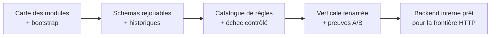
```mermaid {scale: 0.68}
flowchart LR
  T1[Carte des modules<br/>+ bootstrap] --> T2[Schémas rejouables<br/>+ historiques]
  T2 --> T3[Catalogue de règles<br/>+ échec contrôlé]
  T3 --> T4[Verticale tenantée<br/>+ preuves A/B]
  T4 --> W[Backend interne prêt<br/>pour la frontière HTTP]
```

<div class="tp-card tp-card--pulse tp-mt-3"><strong>Objectif W001 atteint</strong> : construire une capacité multi-tenant dans un monolithe modulaire, la rejouer depuis une base vide et prouver ses frontières.</div>

<!--
**Message à faire passer**

L'objectif de W001 est l'assemblage des artefacts produits par les quatre tickets, pas la répétition d'un seul scénario.

**Déroulé oral**

Faites nommer l'artefact de chaque étape avant de révéler le suivant. T01 fournit la carte de propriété. T02 fournit l'état rejouable. T03 fournit le garde-fou interne. T04 fournit la première verticale et ses preuves. La flèche finale vers HTTP montre une préparation, pas une livraison : le socle interne est prêt à recevoir un nouvel adapter.

**Insister sur**

Si un artefact manque, la preuve finale perd une qualité : explicabilité, reproductibilité, durabilité ou isolation.

**Transition**

Une dernière question de transfert vérifie que l'apprenant distingue ce qui doit changer de ce qui doit rester stable.
-->

---

<div class="tp-kicker">Transfert borné · préparer T05</div>

# Quand HTTP arrive, quelle frontière doit bouger ?

<div class="tp-grid-2 tp-mt-5">
  <div class="tp-card"><strong>Évolue</strong><br><span class="tp-muted">L’adapter entrant et la manière d’obtenir le <code>TenantContext</code> puis, plus tard, l’acteur authentifié.</span></div>
  <div class="tp-card tp-card--pulse"><strong>Reste stable</strong><br><span class="tp-muted">Le cas d’usage reçoit un contexte unique ; les repositories et directories restent tenantés.</span></div>
</div>

<div class="tp-card tp-mt-4"><strong>Question de restitution</strong> : quelle preuve ajouteriez-vous pour garantir qu’un contrôleur ne lit jamais le tenant depuis le body, le path ou un header libre ?</div>

<p class="tp-footref">Transfert vers W001-T05 ; authentification et JWT restent différés à W008.</p>
<!-- AUTO-GENERATED:W001-CLOSING:END -->

<!--
**Message à faire passer**

Le transfert vérifie que l'apprenant sait adapter l'architecture sans annuler les garanties construites en W001.

**Déroulé oral**

La future frontière HTTP devra appeler le fournisseur de contexte une seule fois et transmettre exactement ce contexte au cas d'usage. Elle ne doit pas accepter une organisation libre fournie par l'appelant. Le cœur applicatif, les repositories et les directories restent tenantés. Demandez une preuve Web centrée sur ce contrat, sans ouvrir le cours JWT : un test peut vérifier l'appel unique au provider et l'absence de champ tenant dans les DTO ou routes.

**Insister sur**

Changer la source du contexte n'autorise pas à déplacer la responsabilité tenant dans le contrôleur.

**Transition**

W001 est clos : l'apprenant peut expliquer, construire, prouver et transférer la décision avant d'aborder la première API.
-->
