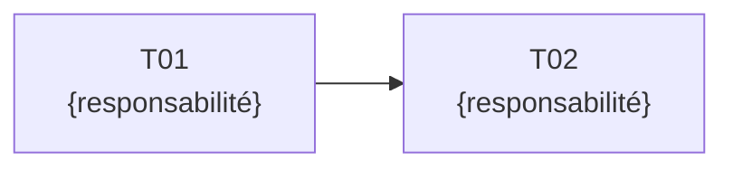
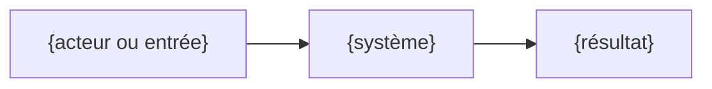

<!--
  TEMPLATE de semaine — copier vers pages/weeks/Wxxx.md
  Pattern narratif : Situation → Risques → Besoins → Garanties → Contraintes →
  Révélation Wxxx → Contrat pédagogique → Preuves → Découpage → Architecture → deep dives.
  Les incohérences NE vont PAS ici : elles vont dans pages/coherence.md
  (zone AUTO-GENERATED:Wxxx-COHERENCE), dernier slide du deck.
-->

---
layout: center
class: tp-section
routeAlias: wxxx
transition: fade
---

<!-- AUTO-GENERATED:Wxxx:START -->

Situation initiale · {Produit ou contexte}

# {Tension concrète avant la solution}

<PulseLine />

{Scène de départ : acteurs, objectif immédiat et difficulté observable.}

<v-click>

Question de départ : {question à laquelle la semaine doit répondre}.

</v-click>

---

## Ce qui peut mal tourner

**Dans le produit ou le métier**

<v-clicks>

- {Symptôme observable 1}
- {Symptôme observable 2}

</v-clicks>

**Dans le système ou l'équipe**

<v-clicks>

- {Symptôme observable 3}
- {Symptôme observable 4}

</v-clicks>

<v-click>

{Risque principal si le problème n'est pas traité maintenant.}

</v-click>

---

## Expression du besoin fonctionnel

En tant que {acteur}, nous voulons {capacité} afin de {valeur attendue}.

<v-clicks>

- {Capacité fonctionnelle 1}
- {Capacité fonctionnelle 2}
- {Résultat produit attendu}

</v-clicks>

---

## Du besoin aux garanties techniques

| Qualité recherchée | Garantie attendue |
| ------------------ | ----------------- |
| **{Qualité 1}** | {Garantie mesurable} |
| **{Qualité 2}** | {Garantie mesurable} |
| **{Qualité 3}** | {Garantie mesurable} |

Les outils seront introduits ensuite, uniquement pour matérialiser ces garanties.

---

## Contraintes et hors-périmètre

<h3>Contraintes Wxxx</h3>

- {Contrainte structurante}
- {Contrainte d'environnement}
- {Contrainte de validation}

<h3>Ce que Wxxx ne cherche pas à faire</h3>

- {Non-objectif 1}
- {Non-objectif 2}
- {Complexité volontairement différée}

---
layout: center
class: tp-section
transition: fade
---

Semaine xxx · Phase {1|2|3}

# {Titre de la semaine}

<PulseLine />

{Objectif synthétique, maintenant que le problème est compris.}

{n} livrés
{n} planifiés

---

## Wxxx · Le contrat pédagogique

À la fin de la semaine, l'apprenant doit pouvoir :

<v-clicks>

- **Expliquer** {concept et différence structurante}
- **Justifier** {décision d'architecture}
- **Configurer** {comportement concret}
- **Prouver** {résultat avec une validation exécutable}

</v-clicks>

---

## Wxxx · La destination avant le chemin

| Résultat attendu | Preuve observable |
| ---------------- | ----------------- |
| {Résultat 1} | `{commande, test ou métrique}` |
| {Résultat 2} | `{commande, test ou métrique}` |
| {Résultat 3} | `{commande, test ou métrique}` |

---

## Wxxx · Le découpage en tickets

| Ticket | Sujet   | ADR                                           | État                                                  |
| ------ | ------- | --------------------------------------------- | ----------------------------------------------------- |
| `T01`  | {sujet} | ADR-Wxxx-T01 | terminé  |
| `T02`  | {sujet} | ADR-Wxxx-T02 | planifié  |

---

## Wxxx · L'ordre fait partie de l'architecture

<v-clicks>

- `T01` réduit {incertitude} avant `T02`
- `T02` s'appuie sur {preuve produite par T01}

</v-clicks>

---

## Wxxx · Architecture cible de la semaine

Transition : le problème, les garanties, la destination et l'ordre sont connus. Le premier ticket peut commencer.

<!-- AUTO-GENERATED:Wxxx:END -->

---

layout: center
class: tp-section
transition: fade
routeAlias: wxxx-t01
---

<!-- AUTO-GENERATED:Wxxx-T01:START -->

Wxxx · Découpage 1/{n}

# T01 — {Sujet}

<PulseLine />

{Objectif du ticket en une phrase.}

---

## T01 · Besoin & décision

<!-- deux colonnes : livrables attendus / décisions ADR -->

---

## T01 · Implémentation

<!-- code observé dans le commit, séquence technique -->

---

## T01 · Validation & bilan

<!-- preuve (tests, commandes) + ce qui est acquis -->

<!-- AUTO-GENERATED:Wxxx-T01:END -->
